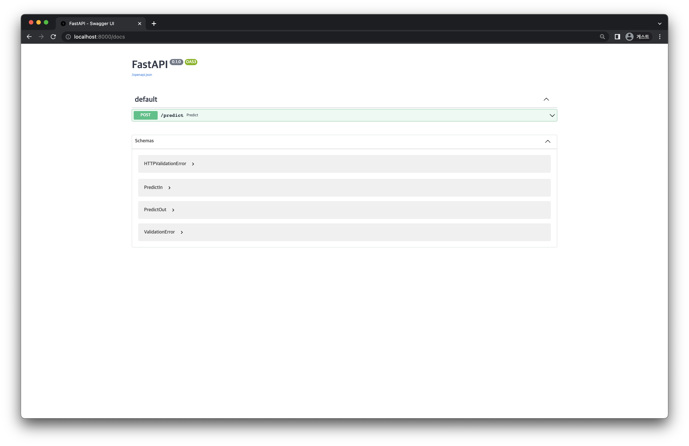

# 1) Model API
import CodeDescription from '@site/src/components/CodeDescription';
import BrowserWindow from '@site/src/components/BrowserWindow';
import { Chapter, Part } from '@site/src/components/Highlight';


### 목표

1. Iris 데이터를 입력받아 예측값을 반환하는 API 를 작성합니다.
2. 작성한 API 에 데이터를 전달하여 제대로 작동하는지 확인합니다.

<details>
<summary>스펙 명세서</summary>
<CodeDescription>

### 스펙 명세서

1. <Part>03. Model Registry</Part> 파트에서 모델을 학습한 후 저장한 레지스트리에서 모델을 로컬로 다운로드받는 스크립트 `download_model.py` 를 작성하고 실행합니다.
2. `POST /predict` 를 수행하면 학습한 모델의 inference 결과를 반환하는 API 의 명세서를 작성합니다.
3. `schemas.py` 에서 Pydantic 을 사용해 input schema 와 output schema 의 클래스를 작성합니다.
    - Input schema: `Class PredictIn(BaseModel)` 을 이용
        - Column 이름: <Part>01. Database</Part> 파트에서 작성한 이름과 동일
    - Output schema: `Class PredictOut(BaseModel)` 을 이용
        - Column 이름: `iris_class`
4. 작성한 명세서를 FastAPI 를 이용해 `app.py` 에 구현합니다.
5. 작성한 API 에 데이터를 전달하여 잘 작동하는지 확인합니다.

</CodeDescription>
</details>

---

<BrowserWindow url="https://github.com/mlops-for-mle/mlops-for-mle/tree/main/ch6">

해당 파트의 전체 코드는 [mlops-for-mle/ch6/](https://github.com/mlops-for-mle/mlops-for-mle/tree/main/ch6) 에서 확인할 수 있습니다.

```js
ch6
├── Dockerfile
├── Makefile
├── README.md
// highlight-next-line
├── app.py
├── docker-compose.yaml
// highlight-next-line
├── download_model.py
// highlight-next-line
└── schemas.py
```

</BrowserWindow>

## 0. 환경 설정
이번 파트에서 사용할 패키지들을 설치합니다.

```bash
# terminal-command
pip install boto3==1.26.8 mlflow==1.30.0 "fastapi[all]" pandas scikit-learn
```

또한, 이번 파트에서도 FastAPI 를 사용하여 API 서버를 실행할 예정이므로 port 가 겹치는 문제를 막기 위해 05. FastAPI 파트에서 띄운 도커 컨테이너를 종료해야 합니다. 다음 명령어를 통해 종료시킵니다.

```bash
# terminal-command
docker rm --force api-server
```

## 1. 모델 다운로드

### 1.1 Base Setting
먼저 필요한 패키지들을 import 합니다.

```python
import os
from argparse import ArgumentParser

import mlflow
```

### 1.2 Environment Variables
다음으로는 레지스트리에 저장되어 있는 모델을 다운로드하기 위해 해당 레지스트리에 접속하기 위한 정보를 환경 변수로 설정합니다.

```python
# Set environments
os.environ["MLFLOW_S3_ENDPOINT_URL"] = "http://localhost:9000"
os.environ["MLFLOW_TRACKING_URI"] = "http://localhost:5001"
os.environ["AWS_ACCESS_KEY_ID"] = "minio"
os.environ["AWS_SECRET_ACCESS_KEY"] = "miniostorage"
```

이는 <Part>03. Model Registry</Part> 파트에서 레지스트리로부터 모델을 load 할 때 사용하는 환경 변수와 같습니다.

### 1.3 모델 다운로드 함수 작성
이제 `mlflow` 패키지를 이용하여 model artifacts 를 다운로드합니다.

여기에서 model artifacts 란, MLFlow 에 모델이 저장될 때 함께 저장된 메타데이터와 모델 자체의 binary 파일을 의미합니다.

다음과 같이 `download_model()` 이라는 함수를 작성합니다.

```python
def download_model(args):
    # Download model artifacts
    mlflow.artifacts.download_artifacts(artifact_uri=f"runs:/{args.run_id}/{args.model_name}", dst_path=".")
```

MLFlow server 에서 `run_id` 와 `model_name` 을 확인하여 입력해주면 해당하는 모델을 찾아 다운로드받을 수 있습니다.

### 1.4 모델 다운로드
다음과 같이 `argparse` 를 이용하여 파라미터를 입력받을 수 있도록 하고 `donwload_model()` 함수를 호출합니다.

```python
if __name__ == "__main__":
    parser = ArgumentParser()
    parser.add_argument("--model-name", dest="model_name", type=str, default="sk_model")
    parser.add_argument("--run-id", dest="run_id", type=str)
    args = parser.parse_args()

    download_model(args)
```

### 1.5 `download_model.py`
작성한 코드를 모으면 아래와 같습니다.

```python title="download_model.py"
import os
from argparse import ArgumentParser

import mlflow

# Set environments
os.environ["MLFLOW_S3_ENDPOINT_URL"] = "http://localhost:9000"
os.environ["MLFLOW_TRACKING_URI"] = "http://localhost:5001"
os.environ["AWS_ACCESS_KEY_ID"] = "minio"
os.environ["AWS_SECRET_ACCESS_KEY"] = "miniostorage"


def download_model(args):
    # Download model artifacts
    mlflow.artifacts.download_artifacts(artifact_uri=f"runs:/{args.run_id}/{args.model_name}", dst_path=".")


if __name__ == "__main__":
    parser = ArgumentParser()
    parser.add_argument("--model-name", dest="model_name", type=str, default="sk_model")
    parser.add_argument("--run-id", dest="run_id", type=str)
    args = parser.parse_args()

    download_model(args)
```

### 1.6 스크립트 실행
먼저 다운로드받고자 하는 모델의 MLFlow 서버에서 저장된 `run_id` 와 `model_name` 을 알아야 합니다.  
[http://localhost:5001](http://localhost:5001) 에 접속하여 모델이 저장된 experiments 와 run 을 선택하여 클릭합니다.
[그림 6-2]의 빨간색 상자 부분에서 `run_id` 와 `model_name` 을 각각 확인할 수 있습니다.

<div style={{textAlign: 'center'}}>


[그림 6-2] Run Detail
</div>

이제 작성한 스크립트 `download_model.py` 를 실행하여 모델을 로컬에 다운로드합니다.
```bash
# terminal-command
python download_model.py --model-name sk_model --run-id <run-id>
```
:::caution
`<run_id>` 부분에는 MLFlow server 에 접속하여 확인한 모델의 `run_id` 를 입력해주면 됩니다.
:::

스크립트를 실행하고 나면, `ch6` directory 안에 `sk_model` 이라는 directory 가 생성됩니다.

```bash
sk_model
├── MLmodel
├── conda.yaml
├── input_example.json
├── model.pkl
├── python_env.yaml
└── requirements.txt
```

`sk_model` 안에는 다운로드받은 모델과 메타데이터 등이 들어 있습니다.
모델이 들어있는 이 directory 를 이용해 이제 Model API 를 작성해보겠습니다.

## 2. Model API 명세서 작성
`POST /predict` 를 수행했을 때 학습한 모델의 inference 결과를 반환해주는 API 의 명세서를 작성합니다. Request body 로 iris 데이터를 전달해주면 response body 를 통해 예측된 값을 전달받게 됩니다.  

이를 표로 나타내면 다음과 같습니다.

| Request Header | Request Body | Response Body |
| --- | --- | --- |
| POST /predict | {<br/>&emsp;"sepal_length": 6.7,&emsp;<br/>&emsp;"sepal_width": 3.3,<br/>&emsp;"petal_length": 5.7,<br/>&emsp;"petal_width": 2.1&emsp;<br/>} | {<br/>&emsp;"iris_class": 2&emsp;<br/>} |


## 3. Pydantic Model 로 스키마의 클래스 작성

### 3.1 Import
먼저, Pydantic Model 을 사용하기 위해 import 합니다.

```python
from pydantic import BaseModel
```

### 3.2 Input schema
API 에서 입력으로 들어가게 될 데이터의 스키마를 클래스로 작성합니다. 스펙 명세서에 맞게 `Class PredictIn(BaseModel)` 을 작성합니다.

```python
class PredictIn(BaseModel):
    sepal_length: float
    sepal_width: float
    petal_length: float
    petal_width: float
```

Iris 데이터에서 각 column 의 데이터 타입은 `float` 이므로 위와 같이 작성해 줍니다.

### 3.3 Output schema

API 에서 반환할 데이터의 스키마를 클래스로 작성합니다. 스펙 명세서에 맞게 `Class PredictOut(BaseModel)` 을 작성합니다.

```python
class PredictOut(BaseModel):
    iris_class: int
```

모델이 반환하는 값은 예측된 클래스로 0, 1, 2 중 하나이기 때문에 `int` 타입으로 작성해 줍니다.

### 3.4 `schemas.py`
작성한 코드를 모으면 아래와 같습니다.

```python title="schemas.py"
from pydantic import BaseModel

class PredictIn(BaseModel):
    sepal_length: float
    sepal_width: float
    petal_length: float
    petal_width: float

class PredictOut(BaseModel):
    iris_class: int
```

## 4. Predict API 구현

### 4.1 Import

먼저, 필요한 패키지들을 import 합니다.

```python
import mlflow
import pandas as pd
from fastapi import FastAPI
from schemas import PredictIn, PredictOut
```

### 4.2 Load model

앞서 로컬에 다운로드받은 모델을 load 하는 함수를 작성합니다.

다음과 같이 `mlflow` 패키지를 이용하여 모델을 쉽게 load 할 수 있습니다.

```python
def get_model():
    model = mlflow.sklearn.load_model(model_uri="./sk_model")
    return model

MODEL = get_model()
```

### 4.3 Create a FastAPI instance

앞서 <Part>05. FastAPI</Part> 파트에서 학습한 FastAPI 를 이용해 API 를 구현하기 위해 FastAPI instance 를 생성합니다.

```python
# Create a FastAPI instance
app = FastAPI()
```

### 4.4 Write `predict` function

API 에 `POST /predict` 를 수행했을 때 학습한 모델의 inference 결과를 반환할 수 있도록 `predict` 함수를 작성합니다.

```python
@app.post("/predict", response_model=PredictOut)
def predict(data: PredictIn) -> PredictOut:
    df = pd.DataFrame([data.dict()])
    pred = MODEL.predict(df).item()
    return PredictOut(iris_class=pred)
```

요청받은 데이터를 처리하는 순서는 다음과 같습니다.
1. `predict` 함수는 `PredictIn` 클래스의 데이터를 입력으로 받고 `PredictOut` 클래스를 반환하도록 합니다.
2. 입력받은 데이터를 데이터프레임 형태로 변환한 후, 위에서 불러온 모델을 이용하여 inference 결과를 저장합니다.
3. 마지막으로 저장된 결과를 `PredictOut` 클래스에 넣어 반환하면 됩니다.

`POST` method 를 이용하여 예측할 수 있도록 `@app.post` 를 이용한 데코레이터로 함수를 감싸주고, `response_model` 은 `PredictOut` 클래스로 지정해 주면 됩니다.

### 4.5 `app.py`

작성한 코드를 모으면 아래와 같습니다.

```python title="app.py"
import mlflow
import pandas as pd
from fastapi import FastAPI
from schemas import PredictIn, PredictOut

def get_model():
    model = mlflow.sklearn.load_model(model_uri="./sk_model")
    return model

MODEL = get_model()

# Create a FastAPI instance
app = FastAPI()

@app.post("/predict", response_model=PredictOut)
def predict(data: PredictIn) -> PredictOut:
    df = pd.DataFrame([data.dict()])
    pred = MODEL.predict(df).item()
    return PredictOut(iris_class=pred)
```

## 5. API 작동 확인
이제 작성한 API 에 데이터를 전달하여 잘 작동하는지 확인해 보겠습니다.

먼저 다음의 명령어를 입력하여 작성한 API 를 실행합니다.

```bash
# terminal-command
uvicorn app:app --reload
```

이제 [http://localhost:8000/docs](http://localhost:8000/docs) (FastAPI - Swagger UI) 에 접속하여 작동 테스트를 해 봅시다.  
[그림 6-3]과 같이 앞서 작성한 predict 함수가 나타나 있는 화면을 볼 수 있습니다.

<div style={{textAlign: 'center'}}>


[그림 6-3] Model API Server Screen
</div>

API 를 실행하여 앞서 작성한 명세서에 맞게 작동하는지 테스트합니다.

<div style={{textAlign: 'center'}}>


[그림 6-4] Model API Test Screen
</div>

Request body 의 형태에 알맞게 데이터를 전달해주면 [그림 6-4]의 빨간색 부분과 같이 Response body 로 inference 결과가 잘 반환되는 것을 확인할 수 있습니다.
