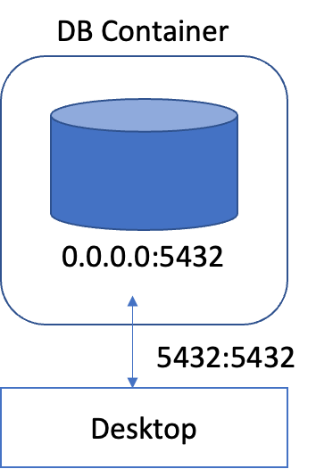
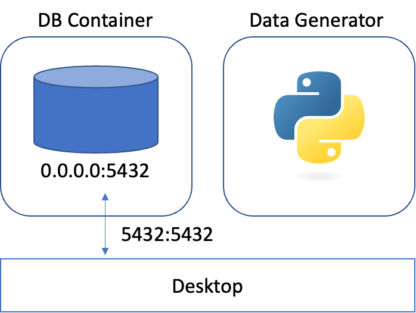

# 5) Data Generator on Docker
import CodeDescription from '@site/src/components/CodeDescription';
import BrowserWindow from '@site/src/components/BrowserWindow';
import { Chapter, Part } from '@site/src/components/Highlight';

### 목표

1. Docker 를 이용하여 data generator 서버를 실행하기 위해 `Dockerfile` 을 작성합니다.
2. DB 안에 데이터가 계속해서 삽입되고 있는지 확인합니다.

<details>
<summary>스펙 명세서</summary>
<CodeDescription>

### 스펙 명세서

1.  <Chapter>4) Data Insertion Loop</Chapter> 챕터에서 작성한 script 를 build 할 수 있는 <code>Dockerfile</code> 을 작성합니다.

    - Base image 는 `amd64/python:3.9-slim` 을 사용합니다.
    - 컨테이너에서 `psql` 을 이용하여 DB 에 접속할 수 있도록 `postgresql-client` 를 설치합니다.
2. <code>psql</code> 을 이용하여 DB 에 데이터가 계속해서 쌓이고 있는지 확인합니다.

    - Local 에서 확인합니다.
    - Data generator 서버에서 확인합니다.

</CodeDescription>
</details>

---

<BrowserWindow url="https://github.com/mlops-for-mle/mlops-for-mle/tree/main/ch1">

해당 파트의 전체 코드는 [mlops-for-mle/ch1/](https://github.com/mlops-for-mle/mlops-for-mle/tree/main/ch1) 에서 확인할 수 있습니다.

```js
ch1
// highlight-next-line
├── Dockerfile
├── Makefile
├── create_table.py
// highlight-next-line
├── data_generator.py
├── docker-compose.yaml
├── insert_data.py
└── insert_data_loop.py
```

</BrowserWindow>

## 1. Data Generator

### 1.1 `data_generator.py`

 <Chapter>4) Data Insertion Loop</Chapter> 챕터에서 작성한 코드들을 모아서 데이터를 생성하는 <code>data_generator.py</code> 를 작성합니다.

```python  title="data_generator.py"
# data_generator.py
import time
from argparse import ArgumentParser

import pandas as pd
import psycopg2
from sklearn.datasets import load_iris


def get_data():
    X, y = load_iris(return_X_y=True, as_frame=True)
    df = pd.concat([X, y], axis="columns")
    rename_rule = {
        "sepal length (cm)": "sepal_length",
        "sepal width (cm)": "sepal_width",
        "petal length (cm)": "petal_length",
        "petal width (cm)": "petal_width",
    }
    df = df.rename(columns=rename_rule)
    return df


def create_table(db_connect):
    create_table_query = """
    CREATE TABLE IF NOT EXISTS iris_data (
        id SERIAL PRIMARY KEY,
        sepal_length float8,
        sepal_width float8,
        petal_length float8,
        petal_width float8,
        target int
    );"""
    print(create_table_query)
    with db_connect.cursor() as cur:
        cur.execute(create_table_query)
        db_connect.commit()


def insert_data(db_connect, data):
    insert_row_query = f"""
    INSERT INTO iris_data
        (sepal_length, sepal_width, petal_length, petal_width, target)
        VALUES (
            {data.sepal_length},
            {data.sepal_width},
            {data.petal_length},
            {data.petal_width},
            {data.target}
        );
    """
    print(insert_row_query)
    with db_connect.cursor() as cur:
        cur.execute(insert_row_query)
        db_connect.commit()


def generate_data(db_connect, df):
    while True:
        insert_data(db_connect, df.sample(1).squeeze())
        time.sleep(1)


if __name__ == "__main__":
    parser = ArgumentParser()
    parser.add_argument("--db-host", dest="db_host", type=str, default="localhost")
    args = parser.parse_args()

    db_connect = psycopg2.connect(
        user="myuser",
        password="mypassword",
        host=args.db_host,
        port=5432,
        database="mydatabase",
    )
    create_table(db_connect)
    df = get_data()
    generate_data(db_connect, df)
```

스크립트를 실행하면 다음과 같은 순서로 실행됩니다.

1. DB 에 연결하는 connector 생성  
    Connector 를 생성할 때 <Chapter>4) Data Insertion Loop</Chapter> 챕터에서 작성한 내용과는 다르게 `host` 를 받는 부분을 다음과 같이 `ArgumentParser` 로 변경했습니다.

    ```python
    parser = ArgumentParser()
    parser.add_argument("--db-host", dest="db_host", type=str, default="localhost")
    args = parser.parse_args()
    ```
    이와 관련해서는 뒤에서 설명하도록 하겠습니다.
2. 연결된 DB 에 <var>`iris_data`</var> 테이블을 생성
3. Iris 데이터 불러오기
4. 불러온 데이터 중 하나를 DB 에 삽입

### 1.2 Dockerfile 작성

#### 1.2.1 Dockerfile

`Dockerfile` 을 이용하여 위에서 작성한 스크립트를 실행할 수 있는 이미지를 만들어보겠습니다. 

<CodeDescription>

```docker title="Dockerfile"
FROM amd64/python:3.9-slim

RUN apt-get update && apt-get install -y postgresql-client

WORKDIR /usr/app

RUN pip install -U pip &&\
    pip install scikit-learn pandas psycopg2-binary

COPY data_generator.py data_generator.py

ENTRYPOINT ["python", "data_generator.py", "--db-host"]
# Change CMD to solve host finding error
CMD ["localhost"]
```

- `FROM` : 이미지를 만들 때 base 가 되는 이미지를 지정합니다. 여기서는 `amd64/python:3.9-slim` 을 사용하도록 하겠습니다.
- `RUN` : 이미지를 만들 때 실행할 코드를 지정합니다. 첫 번째 `RUN` 에서는 해당 Dockerfile 을 이용하여 data generator 서버를 띄울 때, 컨테이너 안에 접근하여 `psql`을 사용하기 위해 `postgresql-client` 을 설치합니다. 두 번째 `RUN` 에서는 컨테이너에서 python 스크립트를 실행할 때 필요한 `scikit-learn`, `pandas`, `psycopg2-binary`를 설치합니다.
- `WORKDIR` : 작업 directory 를 지정합니다. 해당 directory 가 없으면 새로 생성합니다. 작업 directory 를 지정하면 그 이후 명령어는 해당 directory 를 기준으로 동작합니다.
- `COPY` : 파일이나 폴더를 이미지에 복사합니다. 상대 경로를 사용할 경우, `WORKDIR` 로 지정한 directory 를 기준으로 복사합니다. 여기서는 컨테이너에서 실행시키기 위해 앞서 작성한 `data_generator.py`를 복사합니다.
- `ENTRYPOINT` : 컨테이너가 실행될 때 시작할 프로세스를 입력합니다.
- `CMD` : 컨테이너가 실행될 때 `ENTRYPOINT` 에 전달할 arguments 를 입력합니다.

</CodeDescription>

#### 1.2.2 Build

이제 위에서 작성한 `Dockerfile` 을 이용해 이미지를 build 해보겠습니다.

이미지를 build 하기 위해서는 아래 규칙을 따르면 됩니다. 이와 관련한 자세한 내용은 [공식 홈페이지](https://docs.docker.com/engine/reference/commandline/build/)를 참고해주세요.

```bash
# terminal-command
docker build [OPTIONS] PATH | URL | -
```

이미지 이름은 `data-generator` 로 하겠습니다.

```bash
# terminal-command
docker build . -t data-generator
```

이미지가 생성되었는지 확인해 보겠습니다.

```bash
# terminal-command
docker image ls
```

위 명령어를 실행하면 아래와 같이 `data-generator` 가 있음을 확인할 수 있습니다.

```bash
# terminal-command
docker image ls
REPOSITORY                  TAG       IMAGE ID       CREATED         SIZE
data-generator         latest    96d8fa213c74   5 hours ago     635MB
```

#### 1.2.3 Run

이제 build 한 이미지를 실행해 보겠습니다.

```bash
# terminal-command
docker run data-generator
```

실행할 경우 아래와 같이 에러 메세지와 함께 컨테이너가 종료됩니다.

```bash
# terminal-command
docker run data-generator
Traceback (most recent call last):
  File "/usr/app/create_table.py", line 26, in <module>
    db_connect = psycopg2.connect(
  File "/usr/local/lib/python3.9/site-packages/psycopg2/__init__.py", line 122, in connect
    conn = _connect(dsn, connection_factory=connection_factory, **kwasync)
psycopg2.OperationalError: connection to server at "localhost" (127.0.0.1), port 5432 failed: Connection refused
        Is the server running on that host and accepting TCP/IP connections?
connection to server at "localhost" (::1), port 5432 failed: Cannot assign requested address
        Is the server running on that host and accepting TCP/IP connections?
```

해당 에러는 `localhost:5432` 가 응답하지 않고 있다는 에러입니다.

해당 메세지를 읽고 나면 제일 처음 확인해 봐야 할 부분은 DB 컨테이너가 제대로 실행되고 있는지에 대한 여부입니다.

```bash
# terminal-command
docker ps
```

명령어를 실행해보면 현재 DB 컨테이너가 실행 중임을 확인할 수 있습니다.

```bash
# terminal-command
docker ps
CONTAINER ID   IMAGE           COMMAND                  CREATED         STATUS         PORTS                    NAMES
26eeee50afc6   postgres:14.0   "docker-entrypoint.s…"   3 seconds ago   Up 2 seconds   0.0.0.0:5432->5432/tcp   postres-server
```

로컬에서 스크립트를 실행하면 정상적으로 실행이 됩니다.
그럼 왜 `data-generator` 를 실행시키는 컨테이너에서는 접근할 수 없다고 나올까요? 이를 위해서는 docker 의 네트워크에 대해서 이해할 필요가 있습니다.

## 2. Docker Network

### 2.1 Localhost

로컬에서는 어떻게 DB 컨테이너에 접근이 가능했을까요?

<div style={{textAlign: 'center'}}>

  
[그림 1-2] Localhost Networking
</div>

[그림 1-2] 는 컨테이너를 띄운 데스크탑과 컨테이너의 관계를 나타낸 그림입니다.  <Chapter>1) DB Server Creation</Chapter> 챕터에서 DB 컨테이너를 띄울 때 사용한 명령어는 다음과 같습니다.

```bash
# terminal-command
docker run -d \
	...
  -p 5432:5432 \
  postgres:14.0
```

이 때 `-p` 옵션은 포트 포워딩을 의미합니다. 위의 `5432:5432` 를 해석하면 DB 컨테이너의 `5432` 포트를 localhost 의 `5432` 포트로 연결하라는 뜻입니다.  
즉, `localhost:5432` 에 대한 접근은 컨테이너 내부의 `5432` 포트에 대한 접근과 같습니다. 이러한 연결이 있었기 때문에 로컬에서는 DB 에 접근이 가능했습니다.

<div style={{textAlign: 'center'}}>

  
[그림 1-3] Container Networking Disconneted
</div>

[그림 1-3] 는 data generator 의 컨테이너를 실행시켰을 때의 도식입니다.
이 때 data generator 컨테이너 입장에서 `localhost:5432` 는 아무것도 열려있지 않은 비어있는 포트입니다.
그렇기 때문에 DB 를 찾지 못한다는 에러와 함께 종료되는 것입니다.

<div style={{textAlign: 'center'}}>

  
[그림 1-4] Container Networking Connetected
</div>

이를 해결하기 위해서는 [그림 1-4] 처럼 두 컨테이너 간에 통신할 수 있도록 연결해 주어야 합니다.

### 2.2 Connect Network
두 컨테이너를 연결시키는 방법 중 하나로 docker network 를 사용할 수 있습니다.

1. 우선, 컨테이너 간 통신할 수 있는 네트워크를 생성합니다.
    
    ```bash
    # terminal-command
    docker network create my-network
    ```
    
2. 실행 중인 DB 컨테이너를 생성한 도커 네트워크에 연결합니다.
    
    ```bash
    # terminal-command
    docker network connect my-network postgres-server
    ```
    
3. 이제 다시 `data-generator` 이미지를 이용하여 `data-generator` 라는 이름의 컨테이너를 실행합니다.
    <CodeDescription>

    ```bash
    # terminal-command
    docker run --name data-generator --network "my-network" data-generator "postgres-server"
    ```
    
    - `--network` 옵션에 위에서 생성한 네트워크 이름을 입력합니다.
    - 컨테이너를 시작할 때 이미지 이름의 뒤에 입력된 값은 Dockerfile 의 `CMD` 를 수정합니다.
        - 위에서 connector 를 생성할 때 host 를 받는 부분을 수정했었는데 바로 이 경우를 위해서입니다.
        컨테이너 간의 통신을 하는 경우에는 `localhost` 가 아닌 각 컨테이너의 이름이 host 가 됩니다.
        이 때 앞서 띄운 DB 컨테이너의 이름은 `postgres-server` 이기 때문에 argument 로 `postgres-server` 를 입력합니다.

    </CodeDescription>

### 2.3 Data 확인

`psql` 을 이용하여 DB 에 접속하고, 계속해서 데이터가 삽입되고 있는지 확인해보겠습니다.

1. `psql` 을 이용하여 DB 에 접속합니다.
    
    ```bash
    # terminal-command
    psql -h localhost -p 5432 -U myuser -d mydatabase
    Password for user myuser: 
    psql (14.3, server 14.0 (Debian 14.0-1.pgdg110+1))
    Type "help" for help.
    
    mydatabase=#
    ```
    
2.  <Chapter>3) Data Insertion</Chapter> 챕터에서 작성한 <var><code>iris_data</code></var> 테이블에 있는 데이터 전체를 확인하기 위한 query 를 실행합니다.
    
    ```bash
    # terminal-command
    mydatabase=# select * from iris_data;
     id | sepal_length | sepal_width | petal_length | petal_width | target 
    ----+--------------+-------------+--------------+-------------+--------
      1 |          5.6 |           3 |          4.5 |         1.5 |      1
      2 |          5.9 |           3 |          5.1 |         1.8 |      2
      3 |          5.5 |         2.4 |          3.8 |         1.1 |      1
      4 |          5.4 |         3.9 |          1.3 |         0.4 |      0
    (4 rows)
    ```
    
    계속해서 데이터가 추가되고 있는 것을 확인할 수 있습니다.


## 3. 한계

다만 이 방법은 여러 불편함이 있습니다.

우선 통신을 위해서는 컨테이너의 이름을 알아야 합니다.
그리고 서로 연결이 필요한 컨테이너에게 다른 컨테이너의 이름을 전달해주어야 합니다.
이름을 지정해 어느정도 해소할 수 있으나 컨테이너가 예상하지 못한 이유로 종료될 경우 사용된 이름을 점유하고 있어서 다시 실행하기 위해서는 종료된 컨테이너를 삭제해야 합니다.

또한 컨테이너가 실행되는 순서를 보장할 수 없습니다. 예를 들어서 DB 서버가 실행되기 전에 data generator 서버에서 데이터 삽입을 시도하면 해당 컨테이너는 오류와 함께 실행이 종료됩니다.

이처럼 여러 컨테이너 간의 작업을 조율하는 것을 **Container Orchestration** 이라고 하며 도커에서는 자체적인 해결법으로 [Docker Compose](https://docs.docker.com/compose/) 를 제공합니다.
