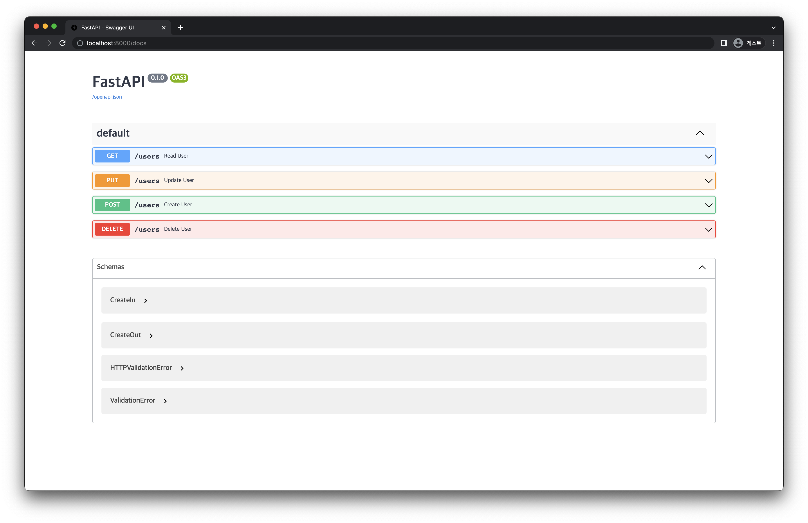

# 3) FastAPI CRUD (Pydantic)
import CodeDescription from '@site/src/components/CodeDescription';
import PreviewDescription from '@site/src/components/PreviewDescription';
import BrowserWindow from '@site/src/components/BrowserWindow';

<PreviewDescription>

## Chapter Preview
---
### 목표

1. 앞서 작성한 API 에서 Create 부분을 Pydantic 을 이용하여 수정합니다.
2. Pydantic 을 사용하기 전과 후에 어떠한 차이가 있는지 학습합니다.


### 스펙 명세서
1. Create API 에서 입력으로 받아야 하는 값들을 `pydantic.BaseModel` 을 이용하여 수정합니다. [[Request Body](https://fastapi.tiangolo.com/tutorial/body/)]
    - `Class CreateIn(BaseModel)` 을 이용
        - `CreateIn` 에서는 이름과 별명을 입력받을 수 있도록 `name` 과 `nickname` 변수를 만듭니다.
    - `Class CreateOut(BaseModel)` 을 이용
        - `CreateOut` 에는 `status` 와 `id` 변수를 만들어 Create 의 operation function 에서 두 변수의 값을 return 하도록 합니다.
        - `id` 는 create 되는 시점의 memory 에 존재하는 데이터의 개수로 정의하여 작성합니다.
2. Create 후 return 하는 값을 Response Model 을 이용하여 수정합니다. [[Response Model](https://fastapi.tiangolo.com/tutorial/response-model/)]
3. Pydantic Model 을 사용하기 전과 후에 API 가 어떻게 달라지는지 비교해 봅니다.

</PreviewDescription>

<BrowserWindow url="https://github.com/mlops-for-mle/mlops-for-mle/tree/main/ch5">

해당 파트의 전체 코드는 [mlops-for-mle/ch5/](https://github.com/mlops-for-mle/mlops-for-mle/tree/main/ch5) 에서 확인할 수 있습니다.

```js
ch5
├── Dockerfile
├── Makefile
├── crud_path.py
// highlight-next-line
├── crud_pydantic.py
├── crud_query.py
├── main.py
├── multi_param.py
├── path_param.py
└── query_param.py
```

</BrowserWindow>

## 1. Pydantic Model

Request Body 는 Client 에서 API 로 전송하는 데이터를 의미합니다.
반대로 Response Body 는 API 가 Client 로 전송하는 데이터를 의미합니다.

이렇게 Client 와 API 사이에 데이터를 주고 받을 때 데이터의 형식을 지정해 줄 수 있는데, 이를 위해 Pydantic Model 을 사용할 수 있습니다.

### 1.1 Base Setting

먼저, 다음과 같이 `pydantic` 으로부터 `BaseModel` 을 import 합니다.

```python
from fastapi import FastAPI, HTTPException
from pydantic import BaseModel
```

앞서 작성한 API 와 마찬가지로 FastAPI 인스턴스를 생성한 후 입력받은 데이터를 저장할 수 있도록 `USER_DB` 를 생성합니다.
또한, `HTTPException` 을 이용하여 에러를 발생할 수 있도록 합니다.

```python
# Create a FastAPI Instance
app = FastAPI()

# User database
USER_DB = {}

# Fail response
NAME_NOT_FOUND = HTTPException(status_code=400, detail="Name not found.")
```

### 1.2 Define Input Schema

다음으로는 입력받아야 하는 데이터의 형태를 지정해줄 수 있도록 `CreateIn` 클래스를 작성합니다.
`pydantic` 의 `BaseModel` 을 상속받은 `CreateIn` 클래스에 Request Body 의 구성 요소가 될 변수들을 attribute 로 지정합니다.
여기서는 이름과 별명을 입력받아야 하므로 다음과 같이 작성합니다.

```python
class CreateIn(BaseModel):
    name: str
    nickname: str
```

### 1.3 Define Output Schema

이번에는 반환하고자 하는 데이터의 형태를 지정해줄 수 있도록 `CreateOut` 클래스를 작성합니다.
마찬가지로 `pydantic` 의 `BaseModel` 을 상속받은 `CreateOut` 클래스에 Response Body 의 구성 요소가 될 변수들을 attribute 로 지정합니다.
스펙 명세서에 맞도록 `status` 와 `id` 변수를 지정해 줍니다.

```python
class CreateOut(BaseModel):
    status: str
    id: int
```

## 2. Response Model

### 2.1 Response Model

`@app.get()`, `@app.post()` 등 다양한 Path Operation 에 `response_model` 을 이용하여 Response Body 에 사용될 데이터 모델을 지정해줄 수 있습니다.
또한, output data 의 type 을 체크하여 자동으로 변환시키고, type 이 유효한지 확인해주고, response 를 위해 자동으로 JSON Schema 를 추가해 주는 등의 역할을 할 수 있습니다.

그 중에서도 `response_model` 의 가장 중요한 역할은 output data 의 형태를 제한해 줄 수 있다는 것입니다.
예를 들면, `response_model=CreateOut` 과 같이 지정해주면 해당 Path Operation 이 실행되었을 때 `CreateOut` 에 존재하는 attribute 의 형태로 데이터를 반환하게 됩니다.
이를 통해, Create API 에 입력하는 데이터로는 `CreateIn` 모델을, 반환하는 데이터로는 `CreateOut` 모델을 사용하도록 지정할 수 있습니다.

### 2.2 API Code

다음과 같이 Response Model 을 활용하여 Create API 를 수정할 수 있습니다.

```python
@app.post("/users", response_model=CreateOut)
def create_user(user: CreateIn) -> CreateOut:
    USER_DB[user.name] = user.nickname
    return CreateOut(status="success", id=len(USER_DB))
```

위의 Path Operation Function 을 보면 parameter 로 `user` 를 입력 받고, type 은 `CreateIn` 인 것을 알 수 있습니다.

`USER_DB[user.name] = user.nickname` 와 같이 Pydantic Model 에 선언된 변수를 사용하여 DB 에 사용자 정보를 저장해 줍니다.

Response Body 에 필요한 변수는 `response_model` 로 지정된 `CreateOut` 모델의 변수인 `status` 와 `id` 이기 때문에 이 변수들의 값을 저장해 주어야 합니다.
`status` 와 `id` 값을 준 `CreateOut` 의 객체를 return 하면 됩니다.

정리하면, `create_user` 함수는 입력으로 `CreateIn` 모델을 받고, `CreateOut` 모델을 반환함으로써 Request 할 때와 Response 할 때 주고받는 데이터에 다른 변수를 사용할 수 있는 것입니다.

### 2.3 `crud_pydantic.py`

전체 코드를 작성한 `crud_pydantic.py` 는 다음과 같습니다.

```python  title="crud_pydantic.py"
# crud_pydantic.py
from fastapi import FastAPI, HTTPException
from pydantic import BaseModel


class CreateIn(BaseModel):
    name: str
    nickname: str


class CreateOut(BaseModel):
    status: str
    id: int

# Create a FastAPI instance
app = FastAPI()

# User database
USER_DB = {}

# Fail response
NAME_NOT_FOUND = HTTPException(status_code=400, detail="Name not found.")


@app.post("/users", response_model=CreateOut)
def create_user(user: CreateIn):
    USER_DB[user.name] = user.nickname
    user_dict = user.dict()
    user_dict["status"] = "success"
    user_dict["id"] = len(USER_DB)
    return user_dict


@app.get("/users")
def read_user(name: str):
    if name not in USER_DB:
        raise NAME_NOT_FOUND
    return {"nickname": USER_DB[name]}


@app.put("/users")
def update_user(name: str, nickname: str):
    if name not in USER_DB:
        raise NAME_NOT_FOUND
    USER_DB[name] = nickname
    return {"status": "success"}


@app.delete("/users")
def delete_user(name: str):
    if name not in USER_DB:
        raise NAME_NOT_FOUND
    del USER_DB[name]
    return {"status": "success"}
```

### 2.4 실행
작성한 코드를 다음의 명령어를 통해 실행합니다.

```bash
# terminal-command
uvicorn crud_pydantic:app --reload
```

이제 [`http://localhost:8000/docs`](http://localhost:8000/docs) 에 접속하면 다음과 같은 Swagger UI 화면을 볼 수 있습니다.

<div style={{textAlign: 'center'}}>


[그림 5-6] `crud_pydantic.py` 실행 화면

</div>

[그림 5-6]의 화면에서 Pydantic Model 을 사용하여 수정한 POST Method 를 클릭하여 수정하기 전후를 비교해 봅시다.

<div style={{textAlign: 'center'}}>


[그림 5-7] Pydantic Model 로 수정하기 전 POST Method

</div>

Pydantic Model 로 수정하기 전에는 [그림 5-7]과 같이 parameter 를 이용하여 데이터를 전달했습니다.

<div style={{textAlign: 'center'}}>


[그림 5-8] Pydantic Model 로 수정한 후 POST Method

</div>

반면, Pydantic Model 로 수정한 후에는 [그림 5-8]과 같이 Request Body 를 통해 데이터를 전달하는 것을 확인할 수 있습니다.

## 3. Pydantic Model 사용 전후 비교

위와 같이 Pydantic Model 을 사용한 클래스를 Response Model 로 지정하여 Create API 를 수정하였습니다.
이처럼 Pydantic Model 을 통해 Response Model 을 사용하면 입력 받는 파라미터와 생성 후 반환하는 파라미터를 다르게 지정해 줄 수 있습니다.
이러한 기능은 비밀번호처럼 사용자가 필수적으로 입력해야 하지만 반환 값에는 나타나면 안 되는 파라미터를 지정할 때 유용하게 사용될 수 있습니다.
