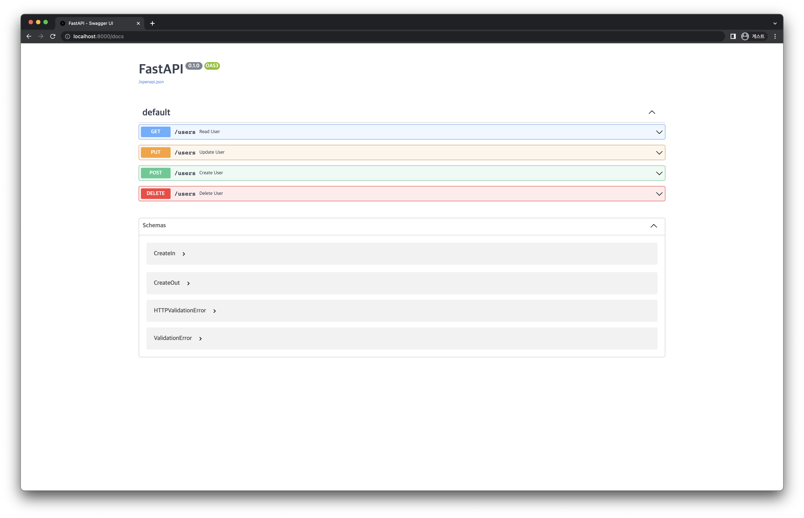

# 4) FastAPI on Docker
import CodeDescription from '@site/src/components/CodeDescription';
import BrowserWindow from '@site/src/components/BrowserWindow';


### 목표

1. 앞서 작성한 API 를 Docker 를 이용하여 실행합니다.

<details>
<summary>스펙 명세서</summary>
<CodeDescription>

### 스펙 명세서

1. 앞서 Pydantic 을 이용하여 수정한 API 를 서버로 실행하기 위해 Dockerfile 을 작성합니다.
    - Base image는 `amd64/python:3.9-slim` 을 사용합니다.
    - `crud_pydantic.py` 를 이용합니다.
    - 포트는 default 포트인 8000번 포트를 이용합니다.
2. [`http://localhost:8000/docs`](http://localhost:8000/docs) 에 접속하여 앞서 수행한 시나리오 등이 제대로 작동하는지 확인합니다.

</CodeDescription>
</details>

---

<BrowserWindow url="https://github.com/mlops-for-mle/mlops-for-mle/tree/main/ch5">

해당 파트의 전체 코드는 [mlops-for-mle/ch5/](https://github.com/mlops-for-mle/mlops-for-mle/tree/main/ch5) 에서 확인할 수 있습니다.

```js
ch5
// highlight-next-line
├── Dockerfile
├── Makefile
├── crud_path.py
├── crud_pydantic.py
├── crud_query.py
├── main.py
├── multi_param.py
├── path_param.py
└── query_param.py
```

</BrowserWindow>

## 1. Dockerfile 작성

### 1.1 Dockerfile

Dockerfile 을 이용하여 앞서 Pydantic 을 이용하여 수정한 API 를 작동시킬 수 있는 API 서버의 Docker 이미지를 만들어보겠습니다.

<CodeDescription>

```docker  title="Dockerfile"
FROM amd64/python:3.9-slim

WORKDIR /usr/app

RUN pip install -U pip \
    && pip install "fastapi[all]"

COPY crud_pydantic.py crud_pydantic.py

CMD ["uvicorn", "crud_pydantic:app", "--host", "0.0.0.0", "--reload"]
```

- <var>RUN</var> : 
  
  - `pip` 를 먼저 업데이트한 후에 `fastapi[all]` 을 설치합니다.
- <var>COPY</var> : 
  
  - Pydantic 을 이용하여 수정한 API 의 코드가 담겨 있는 `crud_paydantic.py` 를 컨테이너 내부로 복사합니다.
- <var>CMD</var> : 
  
  - 컨테이너가 실행될 때 수행할 명령어의 기본값을 적어줍니다. 
  - 여기서는 `uvicorn` 을 이용해 `crud_pydantic.py` 에서 만든 FastAPI 의 객체 `app` 을 실행해 줍니다.

</CodeDescription>

### 1.2 Build

작성한 Dockerfile 을 이용해 이미지를 build 합니다.

이미지 이름은 `ch5-api-server` 로 하겠습니다.

```bash
# terminal-command
docker build -t ch5-api-server .
```

이미지가 잘 생성되었는지 확인합니다.

```bash
# terminal-command
docker image ls
```

다음과 같이 `ch5-api-server` 이미지가 잘 생성되었음을 확인할 수 있습니다.

```bash
# terminal-command
docker image ls
REPOSITORY                  TAG       IMAGE ID       CREATED         SIZE
ch5-api-server             latest    3dec4bf727fe   3 hours ago     249MB
```

### 1.3 Run

이제 build 한 이미지를 실행해 보겠습니다.

<CodeDescription>

```bash
# terminal-command
docker run -d \
  --name api-server \
  -p 8000:8000 \
  ch5-api-server
```

- `-d` : 컨테이너를 detach mode 로 실행합니다. Detach mode 란 백그라운드에서 실행하는 것을 의미합니다.
- `--name` : 컨테이너의 이름을 `api-server` 로 설정합니다.
- `-p` : 포트 포워딩을 `8000:8000` 으로 설정합니다.

</CodeDescription>

이제 컨테이너가 잘 실행되고 있는지 확인합니다.

```bash
# terminal-command
docker ps
```

위의 명령어를 실행해보면 `api-server` 라는 이름을 가진 컨테이너가 실행되고 있음을 확인할 수 있습니다.

```bash
# terminal-command
docker ps
CONTAINER ID   IMAGE             COMMAND                  CREATED          STATUS          PORTS                    NAMES
fb72ccf8fb47   ch5-api-server   "uvicorn crud_pydant…"   13 minutes ago   Up 13 minutes   0.0.0.0:8000->8000/tcp   api-server
```

## 2. API 서버 접속하여 작동 확인

### 2.1 작동 확인
이제 FastAPI 를 통해 만든 API 서버가 잘 작동하는지 확인해 보겠습니다.
API 서버 컨테이너를 실행할 때 포트 포워딩을 `8000:8000` 으로 했으므로 8000번 포트로 접속하면 API 서버로 접속할 수 있습니다.
FastAPI 에서 제공하는 [Interactive API Docs](https://fastapi.tiangolo.com/tutorial/first-steps/#interactive-api-docs) 에 접속하려면 URL 뒤에 `/docs` 를 붙이면 됩니다.

[http://localhost:8000/docs](http://localhost:8000/docs) 에 접속하면 다음과 같이 접속이 되는 것을 확인할 수 있습니다.

<div style={{textAlign: 'center'}}>


[그림 5-4] 작성한 API의 Swagger UI 화면

</div>

[그림 5-4]의 화면에서 앞서 수행한 시나리오와 같은 다양한 작업을 해 보면, 만든 API 가 제대로 작동하는 것을 확인할 수 있습니다.

### 2.2 컨테이너 종료

작동이 잘 되는 것을 확인한 후에는 다음 실습을 위해 컨테이너를 종료해 줍니다. 다음의 명령어를 통해 종료할 수 있습니다.

```bash
# terminal-command
docker rm --force api-server
```
