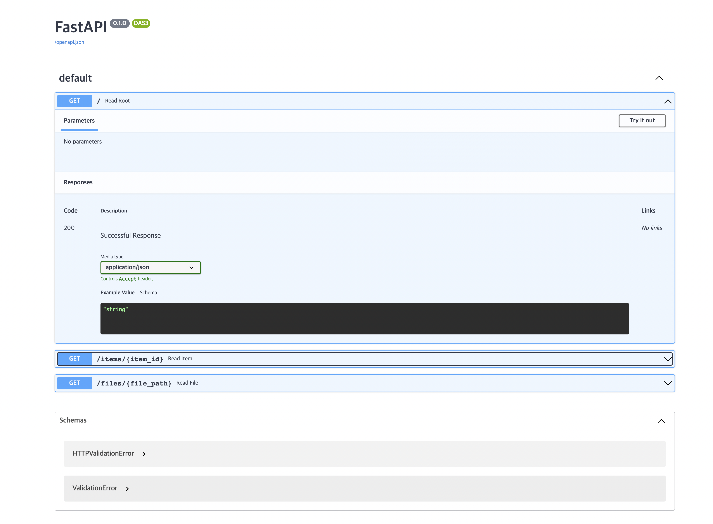

# 1) FastAPI Tutorial

## 목표

1. FastAPI 의 공식 문서를 참고하여 간단한 API 를 만들어봅니다.
2. Path Parameter 와 Query Parameter 를 이해하고 이를 이용하여 API 를 만들어봅니다.

## 스펙 명세서

FastAPI 의 [공식 문서](https://fastapi.tiangolo.com/)를 참고하여 튜토리얼을 진행합니다.

1. 필요한 패키지를 설치합니다.
2. [First Steps](https://fastapi.tiangolo.com/tutorial/first-steps/) 를 따라 FastAPI 를 이용해 간단한 API 를 만들어봅니다.
3. [Path Parameter](https://fastapi.tiangolo.com/tutorial/path-params/) 에 대해 학습합니다.
4. [Query Parameter](https://fastapi.tiangolo.com/tutorial/query-params/) 에 대해 학습합니다.
5. Path parameter 와 Query parameter 를 모두 사용하여 API 를 만들어봅니다. [[Multiple path and query parameters](https://fastapi.tiangolo.com/tutorial/query-params/#multiple-path-and-query-parameters)]

---

## 0. 패키지 설치

필요한 패키지를 설치합니다. [[Tutorial - User Guide - Intro](https://fastapi.tiangolo.com/tutorial/)]

```bash
$ pip install "fastapi[all]"
```

## 1. FastAPI 를 이용해 간단한 API 만들어보기

### 1.1 `main.py`

다음과 같이 `main.py` 를 작성합니다. [[First Steps](https://fastapi.tiangolo.com/tutorial/first-steps/)]

```python
# main.py
from fastapi import FastAPI

# Create a FastAPI instance
app = FastAPI()


@app.get("/")
def read_root():
    return {"Hello": "World"}
```

### 1.2 실행

터미널에 다음 명령어를 입력하여 작성한 파일을 실행합니다. 파일을 실행하는 법은 아래와 같습니다.

```bash
$ uvicorn main:app --reload
```

- `uvicorn` : FastAPI 를 실행하는 웹 서버 실행 Command Line Tool 입니다.
- `main` : 위에서 작성한 python 스크립트 `main.py` 를 의미합니다.
- `app` : `main.py` 에서 `app = FastAPI()` 를 통해 생성된 객체를 의미합니다.
- `--reload` : 코드가 바뀌었을 때 서버가 재시작할 수 있도록 해주는 옵션입니다.

### 1.3 실행 확인

이제 [`http://localhost:8000`](http://localhost:8000) 에 접속해보면 작성한 `{"Hello": "World"}` 가 표시되는 것을 확인할 수 있습니다.

이번에는 [`http://localhost:8000/docs`](http://localhost:8000/docs) 에 접속해 봅시다.
다음과 같은 형태로 된 화면을 볼 수 있습니다.

<div style={{textAlign: 'center'}}>


[그림 5-2] Swagger UI 화면 예시

</div>

이는 [Swagger UI](https://github.com/swagger-api/swagger-ui) 에 의해 제공되는 interactive API documentation 입니다.

이를 통해 작성한 API 를 다양하게 실험을 해보면서 잘 작성 되었는지 테스트해 볼 수 있습니다.

## 2. Step by step 으로 이해하기

이번에는 코드 한 줄 한 줄을 자세히 살펴보겠습니다. [[First Steps](https://fastapi.tiangolo.com/tutorial/first-steps/)]

### 2.1 Step 1: Import FastAPI

API 를 만들 수 있도록 도와주는 Python 클래스 `FastAPI` 를 import 합니다.

```python
from fastapi import FastAPI
```

### 2.2 Step 2: Create a FastAPI instance

`FastAPI` 클래스의 instance 를 생성합니다.

이 때 생성하는 instance 의 이름에 맞게 `uvicorn main:app --reload` 과 같은 형태로 실행을 해 주어야 합니다.

```python
app = FastAPI()
```

### 2.3 Step 3: Create a *path* operation

여기에서 말하는 *path* 는 URL 에서 첫 번째 `/` 부터 시작되는 마지막 부분을 의미합니다.

예를 들어 URL 이 `https://example.com/items/foo` 와 같이 되어 있다면, path 는 `/items/foo` 라고 할 수 있습니다.

“Operation” 은 POST, GET, PUT, DELETE 등과 같은 HTTP “methods” 를 의미합니다.

이러한 operation 을 수행하기 위해 `@app.get("/")` 같은 *path operation decorator* 를 사용합니다.

`@app.get("/")` 은 FastAPI 로 하여금 path `/` 로 가서 `get` operation 을 수행하라는 의미로 사용할 수 있습니다.

### 2.4 Step 4: Define the path operation function

Path operation function 은 path operation 이 수행되었을 때 호출될 Python 함수를 말합니다.

다음과 같은 형태로 사용되었습니다.

```python
@app.get("/")
def read_root():
    return {"Hello": "World"}
```

### 2.5 Step 5: Return the content

Path operation function 을 통해 return 하는 값으로는 `dict` , `list` , `str` , `int` 등이 가능합니다.

또한, 뒤에서 나올 Pydantic models 의 형태로도 return 할 수 있습니다.

## 3. Path Parameter 이해하기

Path Parameter 는 Path operation 에 포함된 변수로 사용자에게 입력받아 function 의 argument 로 사용되는 parameter 를 의미합니다. [[Path Parameters](https://fastapi.tiangolo.com/tutorial/path-params/)]

다음과 같이 `path_param.py` 를 작성하고 `uvicorn path_param:app --reload` 를 통해 실행합니다.

```python
# path_param.py
from fastapi import FastAPI

# Create a FastAPI instance
app = FastAPI()


@app.get("/items/{item_id}")
def read_item(item_id: int):
		return {"item_id": item_id}
```

이와 같은 형태로 path 에 parameter 를 입력하도록 할 수 있습니다.

이렇듯 `item_id` 와 같은 parameter 를 Path Parameter 라고 합니다.

입력된 Path parameter 의 값은 function 에 argument 로 전달되어 함수가 호출됩니다.

또한, `def read(item_id: int)` 와 같이 `int` 라는 type 을 제공할 수 있는데 이 때 제공된 것과 다른 type (예를 들어 `str`) 의 데이터가 입력 되었을 때 다음과 같은 형태로 HTTP Error 를 나타내게 됩니다.

```json
{
    "detail": [
        {
            "loc": [
                "path",
                "item_id"
            ],
            "msg": "value is not a valid integer",
            "type": "type_error.integer"
        }
    ]
}
```

## 4. Query Parameter 이해하기

Query Parameter 는 function parameter 로는 사용되지만 path operation 에 포함되지 않아 Path Parameter 라고 할 수 없는 parameter 를 의미합니다. [[Query Parameters](https://fastapi.tiangolo.com/tutorial/query-params/)]

다음과 같이 `query_param.py` 를 작성하고 `uvicorn query_param:app --reload` 를 통해 실행합니다.

```python
# query_param.py
from fastapi import FastAPI

# Create a FastAPI instance
app = FastAPI()

fake_items_db = [
		{"item_name": "Foo"},
		{"item_name": "Bar"},
		{"item_name": "Baz"}
]


@app.get("/items/")
def read_item(skip: int = 0, limit: int = 10):
    return fake_items_db[skip : skip + limit]
```

Path parameter 와는 다르게, function 에 parameter 로 들어있는 `skip` 과 `limit` 이 path operation 인 `@app.get("/items/")` 에는 들어있지 않습니다.

Query 는 URL 에서 `?` 뒤에 key-value 쌍의 형태로 나타나고, `&` 로 구분되어 사용됩니다.

예를 들면, 위와 같은 경우 `http://127.0.0.1:8000/items/?skip=0&limit=10` 과 같은 형태로 사용할 수 있습니다.

Query Parameter 는 path 의 고정된 부분이 아니기 때문에, optional 로 사용될 수 있고 이에 따라 default 값을 가질 수 있습니다. 

위의 예시에서는 `skip=0` 과 `limit=10` 의 default 값을 가지고 있습니다.

하지만 항상 default 값을 가지는 것은 아니고, 경우에 따라 값을 입력받아야 하지만 path operation 에는 포함이 되어 있지 않아 query parameter 로 구분되는 경우도 존재합니다.

이를 Required Query Parameter 라고 하고 다음과 같은 형태로 사용할 수 있습니다.

```python
@app.get("/items/{item_id}")
def read_user_item(item_id: str, needy: str):
		item = {"item_id": item_id, "needy": needy}
		return item
```

위의 예시에서 `needy` 는 path operation `@app.get("/items/{item_id}")` 에 포함되어 있지 않으므로 query parameter 이고, function `read_user_item()` 에서 default 값이 존재하지 않기 때문에 required query parameter 임을 알 수 있습니다.

이러한 경우 `http://127.0.0.1:8000/items/foo-item` 와 같이 `needy` 를 입력해주지 않으면 에러가 발생합니다.

따라서 `http://127.0.0.1:8000/items/foo-item?needy=someneedy` 와 같은 형태로 `?` 뒤에 입력을 해 주어야 에러가 발생하지 않고 함수가 제대로 동작합니다.

## 5. Multiple path and query parameters 사용해보기

Path parameter 와 Query parameter 를 모두 사용하여 path operation function 을 작성해봅니다. [[Multiple path and query parameters](https://fastapi.tiangolo.com/tutorial/query-params/#multiple-path-and-query-parameters)]

다음과 같이 `multi_param.py` 를 작성합니다.

```python
# multi_param.py
from typing import Union

from fastapi import FastAPI

# Create a FastAPI instance
app = FastAPI()


@app.get("/users/{user_id}/items/{item_id}")
def read_user_item(
    user_id: int, item_id: str, q: Union[str, None] = None, short: bool = False
):
    item = {"item_id": item_id, "owner_id": user_id}
    if q:
        item.update({"q": q})
    if not short:
        item.update(
            {"description": "This is an amazing item that has a long description"}
        )
    return item
```

먼저 path operation 을 보면, `@app.get("/users/{user_id}/items/{item_id}")` 로 되어 있습니다.

이를 통해 `user_id` 와 `item_id` 라는 path parameter 가 있음을 알 수 있습니다.

이번에는 path operation function 의 parameter 를 살펴 보면, `user_id`, `item_id`, `q`, `short` 가 있음을 알 수 있습니다.

이 중 path parameter 가 아닌 `q` 와 `short` 는 query parameter 임을 알 수 있고, default 값이 각각 `None` 과 `False` 임을 알 수 있습니다.

다음과 같은 형태로 URL 을 줄 수 있을 것입니다.

- `http:127.0.0.1:8000/users/3/items/foo-item?q=hello&short=True`
- `http:127.0.0.1:8000/users/3/items/foo-item?short=True`
- `http:127.0.0.1:8000/users/3/items/foo-item?q=hello`
- `http:127.0.0.1:8000/users/3/items/foo-item`