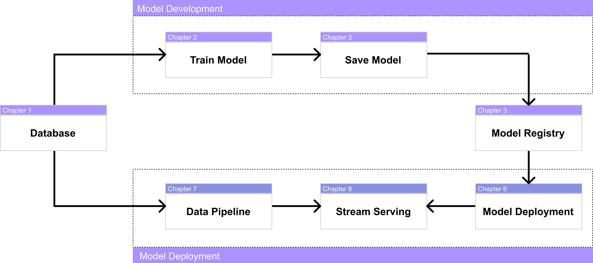
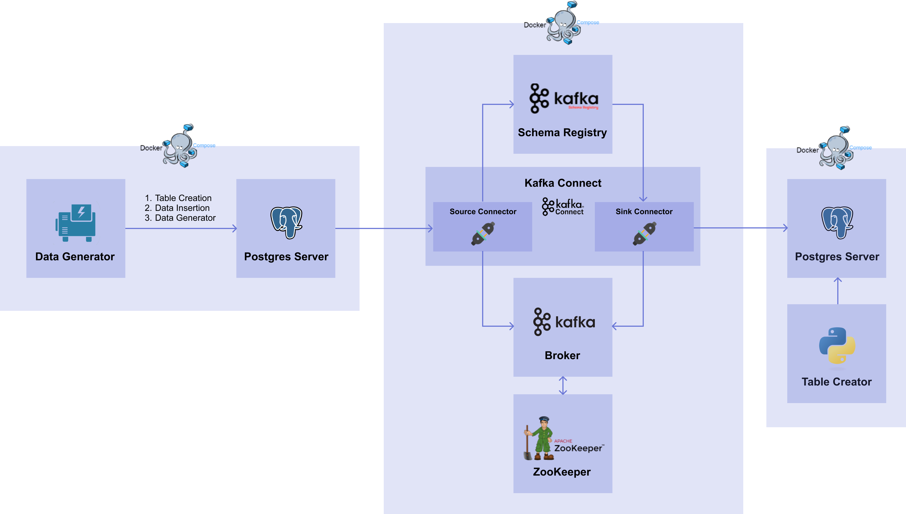

# 00. Introduction
import CodeDescription from '@site/src/components/CodeDescription';
import PreviewDescription from '@site/src/components/PreviewDescription';
import BrowserWindow from '@site/src/components/BrowserWindow';

## Introduction

2022년 MLOps 에 대한 관심은 폭발적으로 증가했습니다. [그림 0-1] 은 “MLOps” 키워드에 대한 구글 트랜드 그래프입니다. 2022년을 기점으로 검색량이 폭발적으로 증가한 것을 확인할 수 있습니다.

<div style={{textAlign: 'center'}}>


[그림 0-1] MLOps Google Trend
</div>


이런 관심의 집중에 따라 MLOps에 관한 많은 포스팅 글들을 찾아볼 수 있습니다. 하지만 대부분은 MLOps 의 개념에 관해서만 다루고 있습니다.
또한, MLOps는 그 자체로 제품 혹은 플랫폼이 될 정도로 방대한 범위를 다루고 있습니다. 대표적인 클라우드 회사에서는 SageMaker (AWS), VertexAI (Google Cloud) 과 같이 MLOps 제품을 출시했습니다.

그런데 정작 이를 사용해야 하는 머신러닝 엔지니어 입장에서는 “그래서 어떻게 MLOps 를 할 수 있는 건데?” 라는 의문이 들 수 밖에 없습니다.
이러한 의문을 조금이라도 풀 수 있도록  “머신러닝 엔지니어를 위한 MLOps”를 집필하였습니다.

## 다루는 내용

### MLOps level: 0

[그림 0-2]는 MLOps 를 설명할 때 많이 쓰이는 구글 클라우드에서 제시한 MLOps 의 0단계 입니다. MLOps 의 목표는 0단계를 자동화시키는 것과 모델 개발 환경과 모델 운영 환경을 일치시키는 것에 있습니다.

<div style={{textAlign: 'center'}}>


[그림 0-2] MLOps Level 0
</div>

“머신러닝 엔지니어를 위한 MLOps” 에서는 직접 구현해보며 각 컴포넌트들이 어떤 역할을 하는지 컴포넌트끼리는 어떻게 연결해야 하는지 설명하고자 합니다. 여기서 다루는 내용을 간단히 도식화 하면 [그림 0-3]과 같이 표시할 수 있습니다.

<div style={{textAlign: 'center'}}>


[그림 0-3] Pipeline
</div>

### Chapter

[그림 0-3] 의 파이프라인을 구현할 기술 스택과 관계도는 [그림 0-4]와 같습니다.

<div style={{textAlign: 'center'}}>


[그림 0-4] Architecture
</div>

각 컴포넌트를 구현하는데 사용하는 패키지 및 소프트웨어는 다음의 기준으로 선정하였습니다.

1. 오픈소스
2. 공식 Documentation 의 관리 여부

대표적으로 사용하는 패키지는 FastAPI, MLflow, Kafka 등이 있습니다.
단순히 따라해보는 것에 그치지 않고 본인의 업무에 필요한 방향으로 적용해 볼 수 있도록 간단한 튜토리얼을 작성하고 MLOps 에 맞게 변형하는 과정으로 진행됩니다.

### Docker

“머신러닝 엔지니어를 위한 MLOps” 는 모든 컴포넌트들을 Docker 로 실행됩니다.

머신러닝의 성능 재현은 머신러닝 모델을 다룰 때 가장 중요한 부분 중 하나입니다.
이를 위해서는 OS, 파이썬 버전, 패키지 버전, 코드, 가중치 등이 모델을 학습했을 때의 환경과 동일해야 합니다.
이런 동일한 환경을 제공하기 위해서  Containerization 은 머신러닝에서 중요한 기술 중 하나이며 이를 대표하는 소프트웨어가 바로 Docker 입니다.
이러한 배경으로 머신러닝 엔지니어는 Docker 를 이해하고 다룰 수 있어야 합니다. 머신러닝 엔지니어가 Docker 를 다루고 이해할 수 있도록 본 문서에서는 로컬 환경에서 실행되는 스크립트를 작성한 후 이를 Docker 환경에서 실행하는 순서로 진행됩니다.

## 이 문서를 학습하는 방법

### Architecture

본 문서에 있는 다음과 같은 구조로 작성되어 있습니다.

1. 각 챕터에서 학습해야 할 목표
2. 목표를 구현하기 위한 스펙 명세서
3. 각 챕터의 전체 코드를 확인할 수 있는 경로
4. 스펙 명세서를 작성하기 위한 코드와 그에 대한 해설

예를 들어 다음에 학습할 챕터는 아래와 같이 작성되어 있습니다.

<BrowserWindow url="https://mlops-for-mle.github.io/tutorial/docs/database/db-server-creation">

<PreviewDescription>

### Chapter Preview
---
#### 목표

1. Docker 를 이용하여 DB 서버를 생성합니다.
2. 생성된 DB 의 role name 과 attributes 를 확인합니다.

#### 스펙 명세서

1. Docker 를 설치합니다.
2. PostgreSQL DB 서버를 생성합니다.
    - <var>Image</var> : <code>postgres:14.0</code>
    - <var>Container name</var> : <code>postgres-server</code>
    - <var>POSTGRES_USER</var> : <code>myuser</code>
    - <var>POSTGRES_PASSWORD</var> : <code>mypassword</code>
    - <var>POSTGRES_DB</var> : <code>mydatabase</code>
    - <var>Port forwarding</var> : <code>5432:5432</code>
3. 생성된 DB 서버를 확인합니다.
    - `psql` 로 DB 에 접근하여 role name 과 attributes 확인

</PreviewDescription>

<BrowserWindow url="https://github.com/mlops-for-mle/mlops-for-mle/tree/main/ch1">

해당 파트의 전체 코드는 [mlops-for-mle/ch1/](https://github.com/mlops-for-mle/mlops-for-mle/tree/main/ch1) 에서 확인할 수 있습니다.

```js
ch1
├── Dockerfile
├── Makefile
├── data_generator.py
├── data_insertion.py
├── data_insertion_loop.py
├── docker-compose.yaml
└── table_creator.py
```

</BrowserWindow>

</BrowserWindow>

좀 더 효율적인 학습을 위해서는 해설을 먼저 보기 보다는 스펙 명세서를 직접 구현한 뒤 설명하는 내용들을 읽는 것을 권장합니다.
