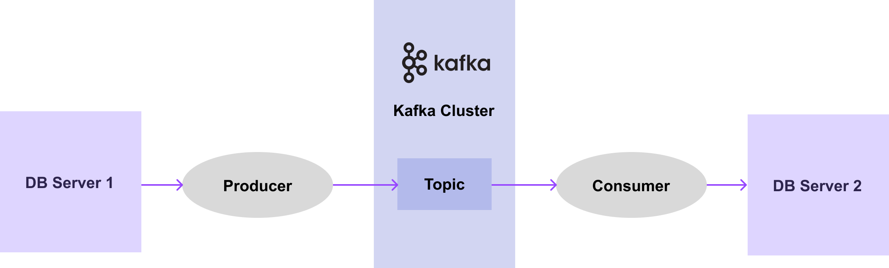
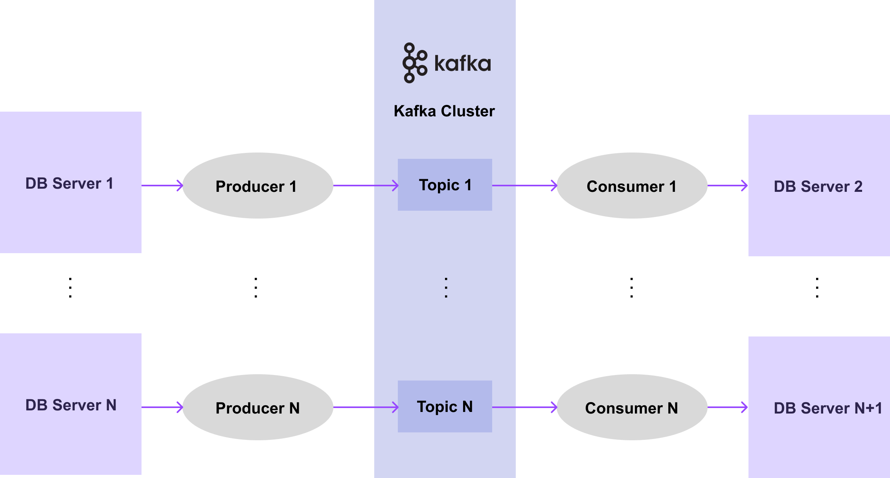
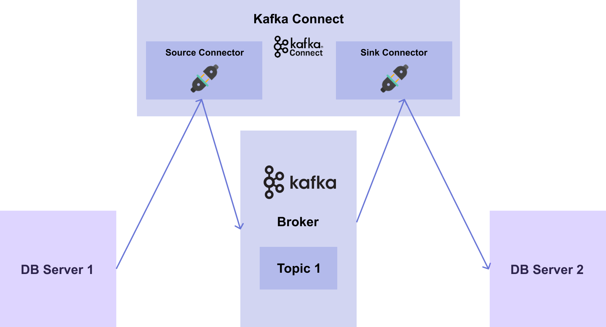
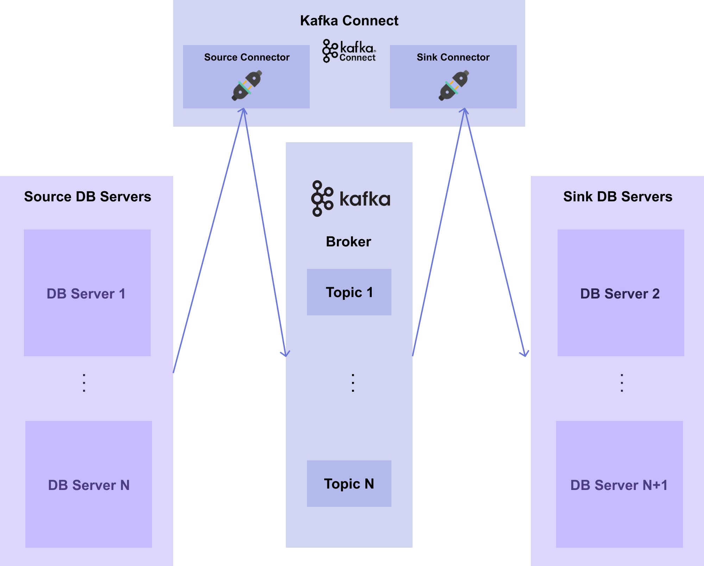
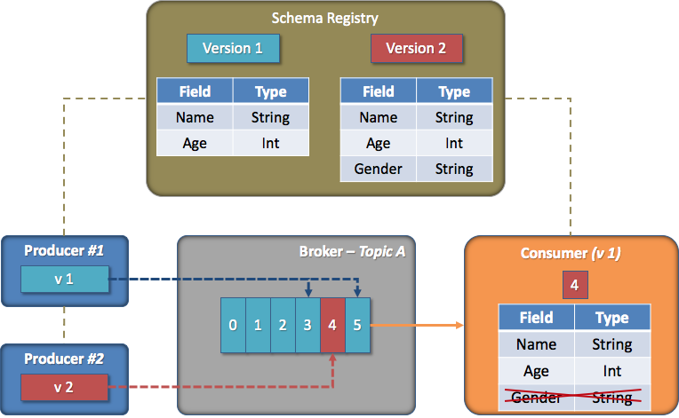

# 3) Connect & Connector
import CodeDescription from '@site/src/components/CodeDescription';
import BrowserWindow from '@site/src/components/BrowserWindow';
import { Chapter, Part } from '@site/src/components/Highlight';

## 목표

1. Kafka 의 connect 와 connector 에 대해 알아봅니다.

---

<BrowserWindow url="https://github.com/mlops-for-mle/mlops-for-mle/tree/main/ch7">

해당 파트의 전체 코드는 [mlops-for-mle/ch7/](https://github.com/mlops-for-mle/mlops-for-mle/tree/main/ch7) 에서 확인할 수 있습니다.

```js
ch7
├── Makefile
├── README.md
├── connect.Dockerfile
├── create_table.py
├── kafka-docker-compose.yaml
├── naive-docker-compose.yaml
├── sink_connector.json
├── source_connector.json
├── target-docker-compose.yaml
└── target.Dockerfile
```

</BrowserWindow>

## 1. Connect & Connector

### 1.1 Producer & Consumer 의 한계

Kafka 는 이전 장처럼 producer 와 consumer client 를 통해 메시지 파이프라인을 쉽게 구성할 수 있었습니다.

하지만 실제 시스템에서는 어떨까요? 아래의 예제를 살펴보겠습니다.  
[그림 7-5] 처럼 어떠한 DB server 1에서 DB server 2로 데이터를 전달하는 시스템을 가정해보겠습니다.

<div style={{textAlign: 'center'}}>

  
[그림7-5] Single Message System

</div>

DB server 1 로부터 데이터를 publish 하는 producer 가 있고, 데이터를 kafka 의 어떤 topic 으로 보낸 뒤, consumer 가 DB server 2에 데이터 보내기 위해 subscribe 하는 과정입니다.

그렇다면 이렇게 전달할 DB 들이 100개, 1000개, 10000개가 있다면 어떨까요? 아마도 아래의 과정처럼 producer 와 consumer 를 100개, 1000개, 10000개로 만들어야 할 것입니다.

<div style={{textAlign: 'center'}}>

  
[그림7-6] Multiple Message System

</div>

하지만 메시지 파이프라인 구성을 위해 매번 producer 와 consumer 를 개발하는 것은 쉽지 않습니다.
특히, 비슷한 data system 이 많아지면 많아질수록 producer 와 consumer 를 개발하는 데에는 비용도 계속 들고 반복 작업이 많아질 수 있습니다.

따라서, 더 간편하고 효율적으로 메시지 파이프라인을 구축하는 방법으로 kafka 에서는 **connect** 와 **connector** 라는 것이 탄생하게 되었습니다.

### 1.2 Connect & Connector 소개

Connect 는 data system 과 kafka 간의 데이터를 확장 가능하고, 안전한 방법으로 streaming 하기 위한 도구입니다.
Connect 를 사용하기 위해서는 데이터를 어디로부터 가져오는지, 어디에다가 전달해야 하는지를 알려주는 connector 를 정의해야 합니다.
여기서 connector 란 메시지 파이프라인에 대한 추상 객체이며, task 들을 관리합니다.

Connect 와 connector 의 역할을 살펴보면, connect 는 “**프레임워크**” 이고 connector 는 그 안에서 돌아가는 “**플러그인**” 입니다.
따라서 connect 프레임워크를 실행하고 특정 connector 플러그인을 실행시키면 메시지 파이프라인을 쉽게 구축할 수 있습니다. 이렇게 구축된 connect 와 connector 를 실행함으로써 개발 비용을 줄이고 반복 작업도 줄일 수 있게 됩니다.

Connector 에는 아래와 같은 두 가지 종류의 connector 가 존재합니다.

- **Source connector** : source system 의 데이터를 broker 의 topic 으로 publish 하는 connector. 즉, producer 의 역할을 하는 connector 입니다.
- **Sink connector** : broker 의 topic 에 있는 데이터를 subscribe 해서 target system 에 전달하는 connector. 즉, consumer 의 역할을 하는 connector 입니다.

각각의 connector 에 관한 설정 (property) 명세를 connect 에 전달하면, 구성된 connector 는 주기적으로 메시지를 확인하고, 새로운 메시지가 있으면 파이프라인을 통해 흘려보냅니다.

앞서 예제로 다뤘던 [그림7-5] 에 대해서 DB server 1에서 DB server 2로 데이터를 전달하는 시스템을 다시 살펴보면 [그림 7-7]과 같은 흐름으로 생각할 수 있습니다.

<div style={{textAlign: 'center'}}>


[그림7-7] Single Connector System

</div>

DB 들이 100개, 1000개, 10000개로 늘어난다면 어떻게 될까요? 아마도 [그림 7-8]처럼 source connector 와 sink connector 를 100개, 1000개, 10000개로 만들어야 할 것입니다.


<div style={{textAlign: 'center'}}>

  
[그림7-8] Multiple Connector System

</div>

그렇다면 앞서 다뤘던 producer 와 consumer 를 만드는 것보다 source connector 와 sink connector 를 만드는 것의 장점이 무엇일까요? 

바로 connector 에 대한 설정파일만 있으면 개발 비용 없이 간단하게 띄울 수 있다는 것입니다.
Source connector 의 경우, connector 의 type, 연결할 URL, user 와 password, table 이름, topic 의 partition 수, replication factor 수 등을 설정해주면 connect 에서 instance 로 생성할 수 있습니다.
이렇게 생성된 connector 들이 100개, 1000개, 10000개의 producer 를 개발하는 것보다는 훨씬 비용이 적고 간편합니다.

### 1.3 Schema registry

마지막으로 connect 와 같이 쓰이는 schema registry 에 대해 알아보겠습니다.
앞서 <Chapter> 1) Kafka Introduction </Chapter> 챕터에서 알아본 것과 같이 kafka 는 decoupling 이라는 특징을 가지고 있습니다.
Producer 와 consumer 가 존재하고, 서로 의존적이지 않고 완벽하게 분리되어 있습니다.
또한 broker 는 메시지를 한 번 저장하면 이후에는 수정할 수 없습니다.

이처럼 kafka 의 구조적인 특징과 내부 구조로 인해 kafka 운영에서는 [그림 7-9]와 같은 상황이 발생할 수 있습니다.

<div style={{textAlign: 'center'}}>

  
[그림7-9] Consume Fail

</div>

[그림 7-9] 상황은 다음과 같습니다.
1. Producer 1과 2는 각자 broker 의 topic A 에 메시지를 보냅니다.
2. Consumer 는 topic A 에서 데이터를 읽습니다.
3. 이때, producer 2가 schema 를 변경하여 메시지 (4번)를 발행합니다.
4. 하지만 consumer 는 이 상황을 알지 못하기 때문에, 4번 메시지를 구독하여 처리하는 과정에서 메시지를 읽어드리지 못하고 장애가 발생합니다.

위와 같은 상황 처럼 결국 구조적인 결합도는 낮췄지만 내부적인 결합도는 여전히 가지고 있게 됩니다.

이러한 문제에 더하여 동일한 schema 의 메시지가 계속 들어오는 경우, 같은 schema 를 계속해서 저장해야하기 때문에 메시지의 크기가 커지며, schema 가 중복이 되어 불필요한 데이터 용량을 차지하게 됩니다.

이러한 구조적인 결합도를 낮추고 불필요한 데이터 용량을 줄이기 위해 kafka 에서는 **schema registry** 를 사용합니다.
**Schema registry** 란 메시지의 schema 를 저장해주는 일종의 저장소입니다.

다음은 kafka connector 가 만들어 내는 메시지 구조입니다.

<div style={{textAlign: 'center'}}>

  
[그림7-10] Connector

</div>

메시지는 key 와 value 로 구성되어 있으며, 각 key 와 value 는 schema 와 payload 로 구성되어 있습니다.
기서 key 는 PK 와 같이 데이터를 식별할 수 있는 정보가 들어있고, value 는 데이터의 전체 값이 들어있습니다.
payload 는 데이터 값이 저장되며, schema 에는 이 데이터 값의 데이터 타입이 명시되어 있습니다.

[그림 7-11]은 producer, schema registry, kafka 간의 관계를 나타냅니다. 

<div style={{textAlign: 'center'}}>

  
[그림7-11] Schema Registry Architecture

</div>

[그림 7-11] 에서 각 컴포넌트가 작동하는 순서는 다음과 같습니다.
1. Producer 에서 kafka 의 serializer (또는 converter) 에게 메시지를 보냅니다.
2. Serializer 는 메시지를 받아 메시지의 schema 를 schema registry 에 보냅니다.
3. 이어서 schema ID 를 받고, schema ID 와 data 를 kafka 에게 보냅니다.
4. Connect 와 connector 를 이용할 때는 serializer 를 직접 구현할 필요없이 connect 를 띄울 때 환경 변수로 적어주면 됩니다. 
 
앞서 살펴봤던 schema 중복 문제는 schema registry 에 key 와 value 에 명시된 schema 를 따로 저장하기 때문에 connector 가 schema 대신 schema registry 의 schema ID 를 명시하여 해결할 수 있게 됩니다.
Schema ID 를 쓰면 메세지의 크기가 줄어들어 불필요한 데이터의 용량도 줄일 수 있습니다.

또한 앞서 발생했던 내부적인 결합도 문제는 schema registry 에서 제공하는 기능 중 하나인 **schema 호환성 규칙 강제 기능**으로 해결할 수 있습니다.
Schema 호환성 규칙 강제란 ****schema 를 등록하여 사용할 수 있지만, schema 버전 간의 호환성을 강제함으로써 일종의 규칙을 세우는 것입니다.

<div style={{textAlign: 'center'}}>

  
[그림7-12] Forward

</div>

[그림 7-12]은 여러 호환성 중 Forward 라는 호환성을 갖는 경우에 대한 예시입니다.

1. Consumer 는 version 1로 메시지를 처리하고 있습니다.
2. 그리고 “Gender” 라는 필드가 버전 2에서 추가되었고, consumer 는 version 2 의 schema 를 메시지를 구독하여 처리합니다.
3. 이때, **consumer 는 새로 추가된 필드를 제외하고, 기존 version 1에 맞춰 메시지를 처리합니다.** 

이렇게 schema 의 호환성 규칙을 강제하여 schema 가 다른 메시지도 읽을 수 있도록 만듭니다.  
