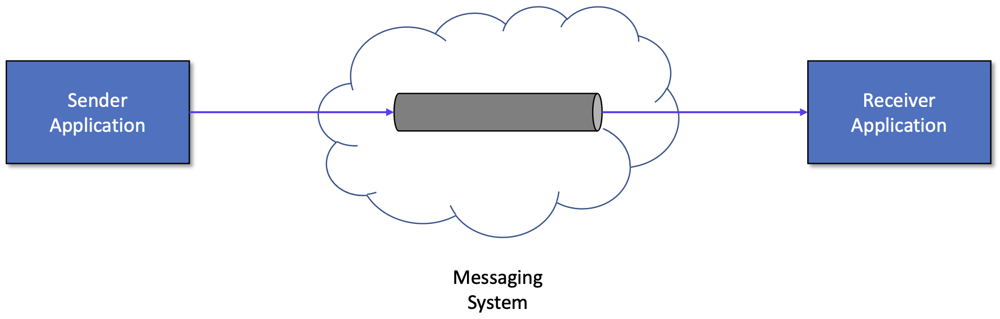
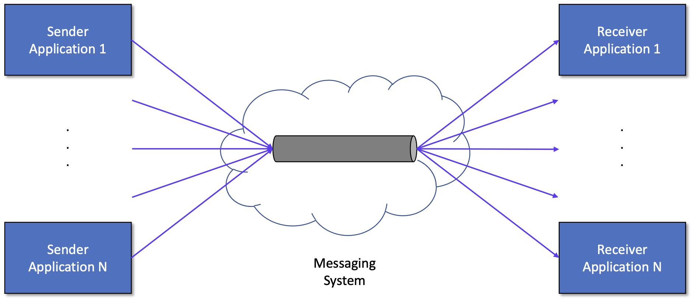

# 1) Kafka Introduction
import CodeDescription from '@site/src/components/CodeDescription';
import BrowserWindow from '@site/src/components/BrowserWindow';


### 목표

1. 메시징 시스템에 대해 알아봅니다.
2. Kafka 의 전체 아키텍처에 대해 알아봅니다.

---

<BrowserWindow url="https://github.com/mlops-for-mle/mlops-for-mle/tree/main/ch7">

해당 파트의 전체 코드는 [mlops-for-mle/ch7/](https://github.com/mlops-for-mle/mlops-for-mle/tree/main/ch7) 에서 확인할 수 있습니다.

```js
ch7
├── Makefile
├── README.md
├── connect.Dockerfile
├── create_table.py
├── kafka-docker-compose.yaml
├── naive-docker-compose.yaml
├── sink_connector.json
├── source_connector.json
├── target-docker-compose.yaml
└── target.Dockerfile
```

</BrowserWindow>

## 1. 메시징 시스템


<div style={{textAlign: 'center'}}>


[그림7-2] 단일 메시징 시스템

</div>

**메시징 시스템 (Message System)** 이란 서로 다른 어플리케이션(Application) 끼리 정보를 교환하기 위해 메시지의 생성, 전송, 전달 및 저장을 가능하게 하는 시스템을 말합니다.

언제 이런 시스템을 이용할까요?  
주로 하나의 어플리케이션이 여러 외부 어플리케이션이나 하나 이상의 데이터 소스로부터 데이터를 받는 어플리케이션에 의해 처리된 데이터를 전달받고 싶을 때 사용합니다.
여기서 **메시지**란 하나의 entity 에서 다른 하나의 entity 로 정보를 전송하는 데 사용되는 통신 아티팩트입니다.

메시징 시스템에는 대표적으로 Kafka, RabbitMQ, Active MQ, AWS SQS, Java JMS 등이 있습니다.

왜 메시징 시스템을 사용할까요?
최근 들어 분산 어플리케이션이 급격히 증가하면서 단일로 사용하던 때에는 발생하지 않았던 동기화, 안정성, 확장성, 보안 등이 문제가 되기 시작했습니다.
이에 대한 한 가지 해결책은 **메시지**를 통해 각 컴포넌트 사이의 **결합성(coupling)** 을 약화시키는 것입니다. 


<div style={{textAlign: 'center'}}>


[그림7-3] 다중 메시징 시스템

</div>


메시징 시스템은 고전적인 분산 컴퓨팅 모델에 비해 여러 장점들을 제공합니다.

먼저, 메시징 시스템은 메시지 생산자(message producer) 와 메시지 소비자(message consumers) 사이에 **약한 결합성(loose coupling)** 을 갖도록 합니다.
약한 결합성이란 한 쪽이 끊기거나 변경이 있어도 다른 쪽에는 미치는 영향이 작은 것을 의미합니다.  

메시징 시스템에서는 약한 결합성을 어떻게 구현했을까요?  
메시징 시스템을 이용할 경우 메시지 생산자와 소비자는 서로를 알지 못합니다.
메시지 소비자에게 있어서, 그 메시지를 누가 생산했고 생선자가 어디에 있는지 또는 메시지가 언제 생산 되었는지의 여부는 중요하지 않게 됩니다.
이러한 메시징 시스템의 특징은 동적이고, 신뢰성 있고 유연한 시스템을 구현할 수 있도록 해주며, 그에 따라 시스템의 나머지 부분에 영향을 주지 않고 하위 어플리케이션의 전체적인 구성을 변경할 수 있습니다.

메시징 시스템의 또 다른 장점은 높은 **확장성**과 서로 다른 네트워크 사이의 쉬운 **통합성** 그리고 **안정성**입니다.  
메시징 시스템의 안정적이고 확장 가능한 특징 때문에, 많은 개발자들이 비지니스와 컴퓨팅 사이언스 문제를 해결하기 위해 사용하고 있습니다.
예를 들어, 메시징 시스템은 워크플로우, 네트워크 관리, 통신 서비스, 고객 관리, 일기 예보 시스템과 같은 다양한 어플리케이션의 기반이 되고 있습니다.
또한, 메시징 시스템은 통합이 필연적인 분리된 시스템들을 엮어주는 매개체의 역할도 하고 있습니다.

### 1.1 용어 정리

메시징 시스템에서 쓰이는 간단한 용어들을 살펴보겠습니다.

#### Message Oriented Middleware (MOM)
- 독립된 애플리케이션 간에 데이터를 주고받을 수 있도록 하는 시스템 디자인
    - 함수 호출, 공유메모리 등의 방식이 아닌, 메시지 교환을 이용하는 중간 계층에 대한 인프라 아키텍처
    - 분산 컴퓨팅이 가능해지며, 서비스간의 결합성이 낮아짐
- 비동기(asynchronous) 로 메시지를 전달함
- Queue, Broadcast, Multicast 등의 방식으로 메시지를 전달함
- Publish/Subscribe (Pub/Sub) 구조
    - 메시지를 발행하는 Publisher (Producer), 메시지를 소비하는 Subscriber (Consumer) 로 구성

#### Message Broker
- 메시지 처리 또는 메시지 수신자에게 메시지를 전달하는 시스템이며, 일반적으로 MOM 을 기반으로 구축됨

#### Message Queue (MQ)
- Message Broker 와 MOM 을 구현한 소프트웨어 (RabbitMQ, ActiveMQ, Kafka 등)
- MOM 은 메시지 전송 보장을 해야하므로 AMQP 를 구현함

#### Advanced Message Queueing Protocol (AMQP)
- 메시지를 안정적으로 주고받기 위한 인터넷 프로토콜

#### Kafka
뒤이어 살펴볼 Kafka 는 “AMQP 를 구현한 MOM 시스템” 이라고 볼 수 있습니다.

## 2. Kafka
### 2.2 Features

Kafka 는 open-source distributed event streaming platform 입니다.  
여기서 event streaming 이란 데이터베이스, 센서, 모바일기기, 어플리케이션 등과 같은 곳에서 발생하는 데이터를 event stream 형태로 저장해서 나중에 검색할 수 있도록 하는 것을 말합니다.
다시 말해, 발생하는 데이터를 실시간으로 처리하고 필요에 따라서 다른 기술 (다른 target system)로 event stream 을 라우팅 해주는 것을 말합니다. 

Kafka 의 주요 특징은 다음과 같습니다.

1. **Event streaming platform** : Event stream 을 실시간으로 처리하고 계속 쌓이는 데이터를 지속적으로 보관하다가 그 데이터를 쓰려고 하는 다른 target system 들이 가져갈 수 있도록 제공합니다.
1. **Publish/Subscribe (Pub/Sub) pattern** : 다른 system 에서 data 를 가져와서 Kafka 에 `publish` (발행, 저장) 하거나 Kafka 로부터 data 를 `subscribe` (구독, 읽기) 할 수 있는 기능을 제공합니다.
1. **Decoupling** : pub/sub pattern 으로 인해 Kafka 에서는 `producer` 와 `consumer` 가 존재하고, 서로 의존적이지 않고 완벽하게 분리되어 있습니다.
    - `Producer` : Kafka 에 event 를 `publish` 하는 client application
    - `Consumer` : Kafka 로부터 event 를 `subscribe` 하는 client application

### 2.2 Kafka Architecture

<div style={{textAlign: 'center'}}>


[그림 7-4] Kafka Architecture

</div>

[그림 7-4]는 Kafka 의 전체 Architecture 로 각각의 컴포넌트들에 대해 알아보겠습니다.

## 3. Kafka Components
### 3.1 Broker

먼저, 브로커(Broker) 란 메시징 서비스를 담당해주는 Kafka 서버 또는 Kafka 시스템을 말합니다. 하나의 브로커는 하나의 Kafka Broker Process 를 의미합니다.
흔히 말하는 “**Kafka 를 구성한다**” 혹은 ”**Kafka 를 통해 메시지를 전달한다**” 에서 Kafka 는 브로커를 의미합니다.

프로세스를 구동하는 방법 (노드의 프로세스, 도커 컨테이너) 따라 다양한 방법으로 클러스터를 구성할 수 있는데 주로 단일 브로커가 아닌 다중 브로커를 사용합니다.
만약, 브로커가 여러 개일 경우, 각각의 브로커들을 ID 로 식별합니다.

브로커의 주요 역할은 **토픽**(**topic) 내의 파티션(partition) 들을 분산, 유지 및 관리**입니다.  
브로커 내부에는 여러 토픽들이 생성될 수 있고, 이러한 토픽들에 의해 생성된 파티션들이 보관하는 데이터에 대해 분산 저장을 해주거나 장애 발생 시 안전하게 데이터를 사용할 수 있도록 도와주는 역할을 합니다.
브로커의 중요한 특징 중 하나는 토픽의 일부 파티션들을 포함하고 있지만, 데이터의 일부분인 파티션을 갖을 뿐 전체 데이터를 갖고 있지는 않습니다. 

### 3.2 Kafka Cluster

Kafka 클러스터(cluster) 는 여러 개의 브로커로 이루어진 집합체를 말합니다. 일반적으로 최소 3대 이상의 브로커를 하나의 클러스터로 구성합니다.

### 3.3 Topic

토픽(Topic)이란 브로커에서 event (data) 를 관리하는 “**기준**” 또는 어떤 event 를 저장할 지를 정하는 “**주제**” 입니다.

토픽은 파일 시스템의 “**폴더**” 와 같고, event 는 폴더 속의 “**파일**” 과 같습니다. 전통적인 메시징 시스템과는 다르게 message (event) 들을 subscribe 해서 받아보더라도 그 message 는 삭제되지는 않습니다.
대신 토픽마다 지정된 기준에 따라 event 를 유지할 지 정할 수 있는데, 이 때 기준은 정해진 기간일 수도 정해진 용량일 수도 있습니다.

### 3.4 Partition

토픽에는 파티션(partition)이 존재하며 모든 파티션들은 producer 로부터 전달된 데이터를 보관하는 역할을 합니다.

파티션은 반드시 존재하는 **leader partition** 과 존재할 수도 있는 **follower partition** 으로 구분됩니다.

- **Leader partition** : leader partition 은 producer 또는 consumer 와 직접 통신하는 partition 입니다. Producer 또는 consumer 와 직접 통신함으로써 read 와 write 연산을 담당합니다.
- **Follower partition** : Producer 에 의해 leader partition 으로 전달된 data 를 replication 하여 복제된 data 를 저장합니다. Follower partition 의 가장 중요한 역할은 leader partition 의 데이터를 복사하여 보관하는 역할을 하고 있다가 leader partition 이 속해있는 broker 에 장애가 발생하면 follower partition 에서 leader partition 의 지위를 가지게 됩니다.

그렇다면 leader partition 과 follower partition 의 개수는 어떻게 정해질까요?  
바로 **replication factor** 의 수에 따라 달라집니다. 예를 들어서 Broker A, B, C 가 있다고 가정해보겠습니다.

1. **Partition 의 replication factor 가 1인 경우 (복제 없음)** : replication factor 가 0 이므로 broker A 의 leader partition 의 데이터를 복제해서 가지고 있을 broker B, C 의 follower partition 이 없습니다. 즉, broker A 에만 leader partition 이 존재합니다. Broker A 의 partition 이 3개였다면, 3개 모두 leader partition 이 됩니다.
2. **Partition 의 replication factor 가 3인 경우 (복제 2개)** : replication factor 가 3 이므로 broker A 의 leader partition 의 데이터를 복제해서 가지고 있을  broker B, C 의 follower partition 이 존재합니다. Broker A 의 partition 이 3개였다면, A, B, C 는 각각 하나의 leader partition 과 두개의 follower partition 을 가지게 됩니다.

### 3.5 Zookeeper
#### 3.5.1 Zookeeper
Zookeeper 는 분산 시스템에서 시스템 간의 정보 유지, 상태 체크, 서버들 간의 동기화 등을 처리해주는 **분산 코디네이션 서비스(distributed coordination service)**입니다.  
Zookeeper 는 직접 어플리케이션 작업을 조율하지 않고, 조율하는 것을 쉽게 개발할 수 있도록 도와줍니다.
API 를 이용해 동기화를 하거나 마스터 선출 등의 작업을 쉽게 구현할 수 있게 해줍니다.
Zookeeper 의 데이터는 분산 작업을 제어하기 위해 트리 형태의 데이터 저장소에 snapshot 을 저장합니다.

#### 3.5.2 Zookeeper Ensemble
Zookeeper ensemble 이란 zookeeper 서버의 클러스터를 뜻하고, zookeeper 서버에 문제가 생겼을 경우, 과반수 이상의 데이터를 기준으로 일관성을 맞추기 때문에 클러스터는 보통 홀수로 구축하며 최소 3개로 구축해야하며 일반적인 경우라면 5개를 권장합니다.

Zookeeper 에서도 파티션처럼 하나의 leader (write) 서버가 있고, 나머지 follower (read) 서버가 있습니다.

### 3.6 Producer & Consumer

#### 3.6.1 Producer

Producer 는 **메시지를 생산(produce)** 해서 브로커의 토픽으로 메시지를 보내는 역할을 하는 어플리케이션 또는 서버입니다.

- 데이터를 전송할 때 leader partition 을 가지고 있는 브로커와 직접 통신합니다.
- 원하는 토픽의 파티션에 전송만하며 이후에 어떤 consumer 에게 전송되는 지는 신경쓰지 않습니다.  
    쉽게 생각하면 우체원이 우편함에 편지를 넣듯 프로듀서는 메세지를 저장만 합니다.

#### 3.6.1 Consumer

Consumer 는 토픽의 파티션에 저장되어 있는 **메시지를 소비(consume)** 역할을 하는 어플리케이션 또는 서버입니다.

- 데이터를 요청할 때 leader partition 을 가지고 있는 브로커와 통신하여 토픽의 파티션으로부터 데이터를 가져갑니다.
- Consumer 운영 방법은 2가지가 있습니다.
    1. 토픽의 특정 partition 만 구독하는 consumer 를 운영
    2. 1개 이상의 consumer 로 이루어진 consumer 그룹을 운영
- Consumer 역시 어떤 producer 에게서 메시지가 왔는지는 관심이 없고, 원하는 토픽의 파티션을 subscribe 하여 필요한 메시지만 받게 됩니다.  
    쉽게 생각하면 우편을 받을 때 어떤 우체원에게서 왔는지는 모르고, 우편함에 있는 편지만 가져가는 것처럼 메세지를 구독만 합니다.
