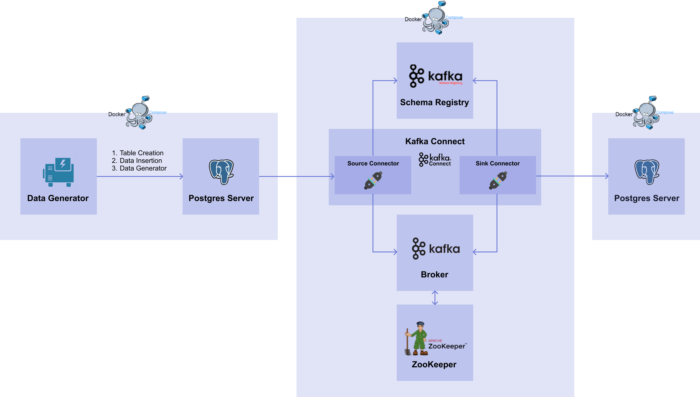

# 0) Overview
import { Chapter, Part } from '@site/src/components/Highlight';

<Part>04. Model Deployment</Part> 파트에서 설명한 Stream Serving 을 구현하기 위해서는 우선 실시간으로 데이터를 전달할 수 있는 데이터 파이프라인을 구축해야 합니다.
이번 파트에서는 Kafka 를 이용하여 데이터 파이프라인을 구축해보겠습니다. 

이번 파트를 통해 완성되는 workflow 를 그림으로 나타내면 [그림 7-1]과 같습니다.

[그림 7-1] Kafka Workflow

실습에 앞서 다음과 같은 가정을 합니다.

1. Source DB: 데이터가 계속해서 쌓이고 있는 외부 DB
2. Target DB: 외부에서 가져온 데이터를 처리한 뒤 쌓이는 내부 DB

여기서 Source DB 로 사용하는 DB 서버는 <Part> 01. Database</Part> 파트에서 작성한 PostgreSQL DB 서버를 사용합니다. 
이번 파트에서는 Kafka 를 이용하여 Source DB 서버에 있는 데이터를 Target DB 로 전달하는 시스템을 구축해보겠습니다.
