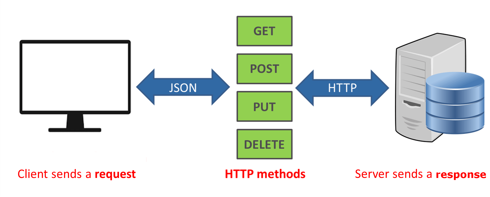

# 04. Model Deployment
import { Chapter, Part } from '@site/src/components/Highlight';

## Request Driven - API Serving

학습이 완료된 모델을 다른 사람이 사용할 수 있도록 하려면 어떻게 해야 할까요?  
예를 들어서 개와 고양이를 분류할 수 있도록 학습된 모델이 있고, 누군가 이 모델을 통해 개와 고양이를 분류하고 싶어 하는 상황을 가정해 봅시다.

단순하게 생각했을 때 저장된 모델과 추론에 사용된 코드를 사용자에게 전달하면,  사용자는 전달받은 모델과 코드를 이용해 개와 고양이를 분류할 수 있을 것입니다. 
그런데 만약 추론하고자 하는 데이터가 핸드폰에서 촬영한 사진이고, 이를 핸드폰에서 바로 분류하고 싶다면 모델과 추론코드를 전달받은 것만으로는 사용하기 힘들 수 있습니다.

왜냐하면 전달받은 모델이 너무 커서 핸드폰에서 불러올 수 없을 가능성이 있기 때문입니다. 
또한, 핸드폰에 설치되어 있는 패키지의 버전이 달라 다르게 작동할 가능성이 있습니다.  
따라서 디바이스의 환경에 따라 모델의 크기 문제, 설치되어 있는 패키지 버전 문제 등 다양한 문제에 의해 모델을 사용할 수 없는 상황이 발생합니다.

이처럼 각기 다른 디바이스에서 모델을 직접 사용하기 어려운 문제를 해결하기 위한 방안으로써 데이터만 전달해주면 어떨까요?  
위의 예시에서는 개 또는 고양이를 찍은 사진을 모델을 돌릴 수 있는 환경으로 전송하면, 그 환경에서 직접 모델을 돌려서 나온 결과를 사용자에게 전달하게 됩니다. 
이렇게 한다면 모델을 사용하고 싶은 사람이 직접 모델을 돌리지 않고도 원하는 결과를 얻을 수 있습니다. 

이와같이 요청을 보내 요청에 대한 응답을 받아 결과를 얻는 방식은 비단 머신러닝 모델뿐만 아니라 많은 소프트웨어에서 사용하는 방식입니다.
이러한 방식을 Request-Response 방식이라고 부릅니다.

[그림 5-1] Rest API (출처: https://phpenthusiast.com/blog/what-is-rest-api)

디바이스끼리 Request-Response 를 하기 위해서는 요청과 응답을 어떻게 할 것인지에 대해서 사전에 정의하는 절차가 필요합니다. 
이러한 것 중 가장 대표적인 방법이 바로 REST API 입니다.

<Part>05. FastAPI</Part> 파트에서는 REST API 를 구현하는 오픈 소스 중 가장 대중적인 FastAPI 를 학습합니다. 
그리고 <Part>06. API Serving</Part> 파트에서는 REST API 를 통해 모델을 사용하여 결과를 얻는 API Serving 에 대해서 학습합니다.

## Event Driven - Stream Serving

만약, 데이터가 계속해서 쌓이고 있는 상황이라면 어떻게 될까요?  
예를 들어서 공장에서 어떤 센서가 부착되어 있고 센서는 정해진 주기마다 계속해서 데이터를 수집하고 저장하고 있는 상황을 가정해 봅시다. 
이렇게 지속적으로 수집되고 있는 데이터에 대해서 실시간으로 이상 탐지를 할 수 있는 모델을 서빙해야 한다면 어떻게 할 수 있을까요?

이러한 경우, 데이터를 수집하고 있는 곳에서 모델에게 계속해서 요청을 보내 결과를 받아오면 될 것 같습니다. 하지만 이 방법은 여러 문제를 가지고 있습니다.  
수집하는 센서는 보통 아주 작은 단위의 업무만 처리할 수 있기에 요청을 보낼 수 없는 경우가 많습니다. 또한 요청을 통해 결과를 받는 주체가 아닌 경우가 많습니다. 
이를 해결하기 위해서는 대신 요청을 보내고 결과를 수집할 수 있는 주체가 필요합니다. 

위의 예시와 같이 지속적으로 데이터를 수집하고 요청을 보내 결과를 수집하는 상황을 Stream 이라고 표현합니다. 
이를 위해 <Part>07. Kafka</Part> 파트에서 인프라를 주로 다루는 Kafka 를 학습합니다.
그리고 <Part>07. Stream</Part> 파트에서 모델에 요청을 보내서 결과를 수집하는 Stream Serving 을 학습하고, 이를 Dashboard 로 연결하여 시각화하는 Grafana 에 대해 학습합니다.
