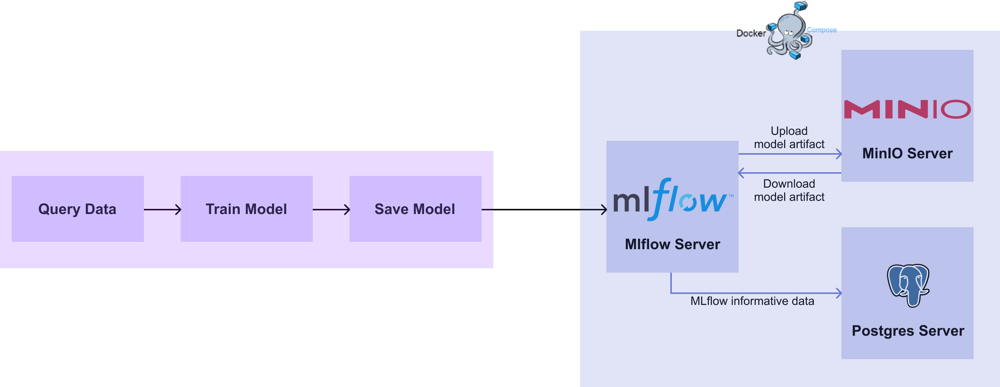
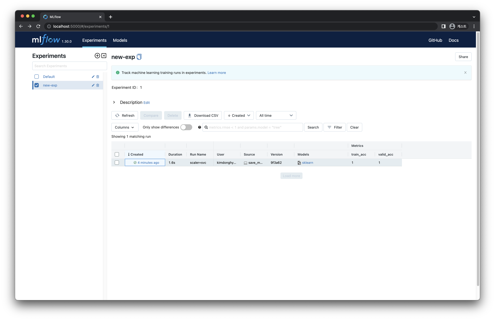
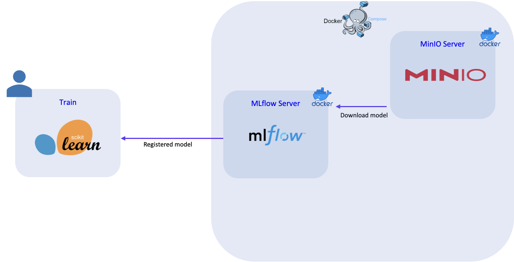

# 2) Save Model to registry
## 목표

1. 모델을 학습하고 mlflow server 에 저장합니다.
2. mlflow 의 모델 저장 구조를 이해합니다.

## 스펙 명세서

1. `02. Model Development` 챕터 에서 사용한 코드를 이용해 모델을 학습합니다.
2. 학습이 끝난 모델을 mlflow 의 built-in method 를 사용해 mlflow server 에 저장합니다.
    - Python의 `mlflow` 패키지를 이용합니다.
        - `pip install mlflow`
    - `mlflow` 를 활용해 모델을 앞 장에서 띄운 mlflow server 에 저장합니다.
    - `mlflow` 를 활용해 모델을 저장하는 방법은 두 가지가 있습니다.
        - artifact 처럼 다루기 [[MLFLow log_artifact](https://mlflow.org/docs/latest/python_api/mlflow.html#mlflow.log_artifact)]
        - built-in method 사용하기
            1. [MLFlow built-in Model Flavors](https://www.mlflow.org/docs/latest/models.html#built-in-model-flavors)
            2. [MLFLow pyfunc log_model](https://mlflow.org/docs/latest/python_api/mlflow.pyfunc.html#mlflow.pyfunc.log_model)
    - 이번 장에서는 `sklearn` 모델을 저장하기 위해 `mlflow.sklean` built-in method 를 사용합니다.
3. 저장된 모델을 작동 중인 mlflow server 에서 확인합니다.
    - 모델이 어떻게 저장되어 있는지 확인합니다. [[MLFlow Storage Format](https://www.mlflow.org/docs/latest/models.html#storage-format)]

<div style={{textAlign: 'center'}}>


[그림 3-6] MLflow Model Save Diagram
</div>

---

## 0. 패키지 설치

아래 명령어를 통해 관련 패키지를 설치합니다.

```bash
$ pip install boto3==1.26.8 mlflow==1.30.0 scikit-learn
```

## 1.  모델 저장하기

`02. Model Development` 챕터에서 작성한 코드의 `# 3. save model` 부분을 변경하여 모델을 업로드하는 코드를 작성합니다.

### 1.1 기존 코드 확인 & 환경 변수 설정

#### 1.1.1 **`db_train.py`**

앞 챕터에서 학습했던 `db_train.py` 코드는 다음과 같습니다.

```python
# db_train.py

import joblib
import pandas as pd
import psycopg2
from sklearn.metrics import accuracy_score
from sklearn.model_selection import train_test_split
from sklearn.pipeline import Pipeline
from sklearn.preprocessing import StandardScaler
from sklearn.svm import SVC

# 1. get data
db_connect = psycopg2.connect(
    user="myuser",
    password="mypassword",
    host="localhost",
    port=5432,
    database="mydatabase",
)
df = pd.read_sql("SELECT * FROM iris_data ORDER BY id DESC LIMIT 100", db_connect)
X = df.drop(["id", "target"], axis="columns")
y = df["target"]
X_train, X_valid, y_train, y_valid = train_test_split(X, y, train_size=0.8, random_state=2022)

# 2. model development and train
model_pipeline = Pipeline([("scaler", StandardScaler()), ("svc", SVC())])
model_pipeline.fit(X_train, y_train)

train_pred = model_pipeline.predict(X_train)
valid_pred = model_pipeline.predict(X_valid)

train_acc = accuracy_score(y_true=y_train, y_pred=train_pred)
valid_acc = accuracy_score(y_true=y_valid, y_pred=valid_pred)

print("Train Accuracy :", train_acc)
print("Valid Accuracy :", valid_acc)

# 3. save model
joblib.dump(model_pipeline, "db_pipeline.joblib")

# 4. save data
df.to_csv("data.csv", index=False)
```

#### 1.1.2 환경 변수 추가

`mlflow` 와 통신하기 위해서는 몇 가지 환경 변수가 설정 되어야 합니다.

[그림 3-6]을 보면 유저가 학습한 모델을 `mlflow-server` 를 통해 Artifact-store 인 `MinIO` 에 저장합니다. 이 과정에서 Artifact-store 의 접근 권한이 필요 하게 됩니다. 이 정보는 앞 장의 `docker-compose.yaml` 에서 설정한 `mlflow-server` , `mlflow-artifact-store` 의 정보와 같습니다. 접근에 사용할 ID, PW 는 사전에 정의된 시스템 환경 변수에 매핑하여 Artifact-store 에 접근 할 수 있습니다. 같은 방식으로 서비스가 띄워져있는 MLflow 서버와 S3(MinIO) 의 URI도 함께 매핑해 줍니다.
```python
import os

os.environ["MLFLOW_S3_ENDPOINT_URL"] = "http://localhost:9000"
os.environ["MLFLOW_TRACKING_URI"] = "http://localhost:5001"
os.environ["AWS_ACCESS_KEY_ID"] = "minio"
os.environ["AWS_SECRET_ACCESS_KEY"] = "miniostorage"
```

- `os` 라이브러리를 이용해 시스템의 환경변수를 설정합니다.
    - `MLFLOW_S3_ENDPOINT_URL` : 모델을 저장할 storage 의 주소입니다. 앞 장에서 띄운 `MinIO` 서버 주소와 같으며 `http://localhost:9000` 입니다.
    - `MLFLOW_TRACKING_URI` : 정보를 저장하기 위해 연결 할 MLflow 서버의 주소 입니다. 앞 장의 MLflow 서버 주소와 같으며 `http://localhost:5001` 입니다.
    - `AWS_ACCESS_KEY_ID` : `MinIO` 에 접근하기 위한 ID 입니다. 앞 장에서 설정한 `MINIO_ROOT_USER` 인 `minio` 를 사용합니다.
    - `AWS_SECRET_ACCESS_KEY` : `MinIO` 에 접근하기 위한 PW 입니다. 앞 장에서 설정한 `MINIO_ROOT_PASSWORD` 인 `miniostorage` 를 사용합니다.

### 1.2 모델 저장하기

`mlflow` 는 정보를 `experiment` / `run` 의 구조로 저장하며 `experiment` 에 `run` 을 동적으로 생성합니다. 이 때, 각각의 `run` 은 unique 한 해쉬값인 `run_id` 를 부여받게 되며 이를 통해서 추후 원하는 정보에 접근 할 수 있습니다.

모델의 결과 등을 저장 할 가장 큰 카테고리인 `experiment` 의 경우 이름을 지정하지 않고 결과를 저장하면 기본 값으로 `Default` 라는 이름의 `experiment` 에 `run` 이 생성됩니다. 실습에서는 `new-exp` 라는 이름을 가진 새로운 `experiment` 를 생성하고, 생성된 `new-exp` 에 `run` 을 만드는 방식으로 진행합니다.

이어서 `02. Model Development` 챕터의 **모델**과 **모델의 결과 metric** 인 정확도를 저장해 보겠습니다.  
`mlflow` 클래스를 이용하여 다음과 같이 작성 합니다.

1. 모델의 이름을 설정 할 수 있는 외부 변수를 설정합니다.
    
    ```python
    from argparser import ArgumentParser
    
    parser = ArgumentParser()
    parser.add_argument("--model-name", dest="model_name", type=str, default="sk_model")
    args = parser.parse_args()
    ```
    
2. `experiment` 를 설정합니다. `mlflow.set_experiment` 함수는 `experiment` 가 존재하지 않는 경우 새로 생성되며, 존재하는 경우 해당 `experiment` 를 사용합니다. 
    
    ```python
    mlflow.set_experiment("new-exp")
    ```
    
3. 모델에 입력으로 주어지는 데이터의 정보들을 설정합니다.
    
    ```python
    signature = mlflow.models.signature.infer_signature(model_input=X_train, model_output=train_pred)
    input_sample = X_train.iloc[:10]
    ```
    
    ```python
    print(signature)
    # inputs: 
    #   ['sepal_length': double, 'sepal_width': double, 'petal_length': double, 'petal_width': double]
    # outputs: 
    #   [Tensor('int64', (-1,))]
    
    print(input_sample)
    # sepal_length  sepal_width  petal_length  petal_width
    # 86           5.7          2.9           4.2          1.3
    # 73           4.5          2.3           1.3          0.3
    # 4            6.9          3.1           4.9          1.5
    # 31           4.9          3.1           1.5          0.2
    # 10           4.6          3.2           1.4          0.2
    # 1            5.4          3.9           1.3          0.4
    # 51           5.6          2.8           4.9          2.0
    # 63           4.4          3.0           1.3          0.2
    # 7            7.4          2.8           6.1          1.9
    # 64           5.5          2.5           4.0          1.3
    ```
    
4. `run` 을 생성하고 정보를 저장합니다.
    - `mlflow.log_metrics` : 모델의 결과 metrics 를 python 의 dict 형태로 받아 생성된 `run` 에 저장합니다.
    - `sklearn` 의 모델은 `mlflow.sklearn` 를 사용하여 간편하게 업로드가 가능합니다.
    - `mlflow.sklearn.log_model` : 학습된 모델 결과물이 `sklearn` 객체일 경우 [[MLFlow Storage Format](https://www.mlflow.org/docs/latest/models.html#storage-format)]의 구조로 `run` 에 저장 합니다.
    
    ```python
    with mlflow.start_run():
        mlflow.log_metrics({"train_acc": train_acc, "valid_acc": valid_acc})
        mlflow.sklearn.log_model(
            sk_model=model_pipeline,
            artifact_path=args.model_name,
            signature=signature,
            input_example=input_sample,
        )
    ```
    
5. 모델은 다음과 구조로 저장됩니다.
    
    ```python
    # Directory written by mlflow.sklearn.save_model(model, "sk_model")
    
    sk_model/
    ├── MLmodel
    ├── model.pkl
    ├── conda.yaml
    ├── python_env.yaml
    └── requirements.txt
    ```
    

## 2. 전체 코드 완성 및 모델 확인

추가 작성한 코드를 전체 코드에 적용하여 완성합니다.

### 2.1 **`save_model_to_registry.py`**

```python
import os
from argparse import ArgumentParser

import mlflow
import pandas as pd
import psycopg2
from sklearn.metrics import accuracy_score
from sklearn.model_selection import train_test_split
from sklearn.pipeline import Pipeline
from sklearn.preprocessing import StandardScaler
from sklearn.svm import SVC

# 0. set mlflow environments
os.environ["MLFLOW_S3_ENDPOINT_URL"] = "http://localhost:9000"
os.environ["MLFLOW_TRACKING_URI"] = "http://localhost:5001"
os.environ["AWS_ACCESS_KEY_ID"] = "minio"
os.environ["AWS_SECRET_ACCESS_KEY"] = "miniostorage"

# 1. get data
db_connect = psycopg2.connect(
    user="myuser",
    password="mypassword",
    host="localhost",
    port=5432,
    database="mydatabase",
)
df = pd.read_sql("SELECT * FROM iris_data ORDER BY id DESC LIMIT 100", db_connect)

X = df.drop(["id", "target"], axis="columns")
y = df["target"]
X_train, X_valid, y_train, y_valid = train_test_split(X, y, train_size=0.8, random_state=2022)

# 2. model development and train
model_pipeline = Pipeline([("scaler", StandardScaler()), ("svc", SVC())])
model_pipeline.fit(X_train, y_train)

train_pred = model_pipeline.predict(X_train)
valid_pred = model_pipeline.predict(X_valid)

train_acc = accuracy_score(y_true=y_train, y_pred=train_pred)
valid_acc = accuracy_score(y_true=y_valid, y_pred=valid_pred)

print("Train Accuracy :", train_acc)
print("Valid Accuracy :", valid_acc)

# 3. save model
parser = ArgumentParser()
parser.add_argument("--model-name", dest="model_name", type=str, default="sk_model")
args = parser.parse_args()

mlflow.set_experiment("new-exp")

signature = mlflow.models.signature.infer_signature(model_input=X_train, model_output=train_pred)
input_sample = X_train.iloc[:10]

with mlflow.start_run():
    mlflow.log_metrics({"train_acc": train_acc, "valid_acc": valid_acc})
    mlflow.sklearn.log_model(
        sk_model=model_pipeline,
        artifact_path=args.model_name,
        signature=signature,
        input_example=input_sample,
    )

# 4. save data
df.to_csv("data.csv", index=False)
```

### 2.2 실행

완성된 코드를 실행합니다.

```bash
$ python upload_model.py --model-name "sk_model"
```

### 2.3 Mlflow에서 결과 확인

코드 실행의 결과를 [localhost:5001](http://localhost:5001)(mlflow server) 에서 확인합니다.

<div style={{textAlign: 'center'}}>


[그림 3-7] 모델 저장 결과
</div>

<div style={{textAlign: 'center'}}>


[그림 3-8] 모델 저장 결과 상세
</div>
