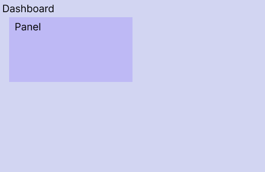
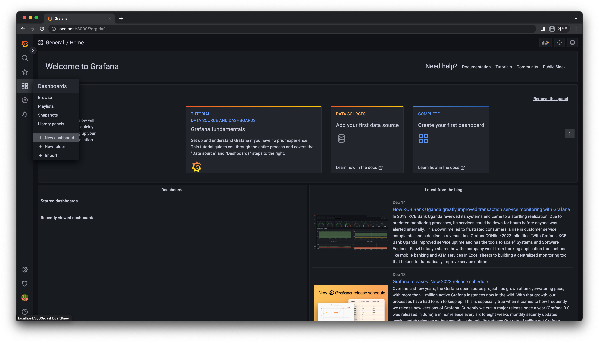
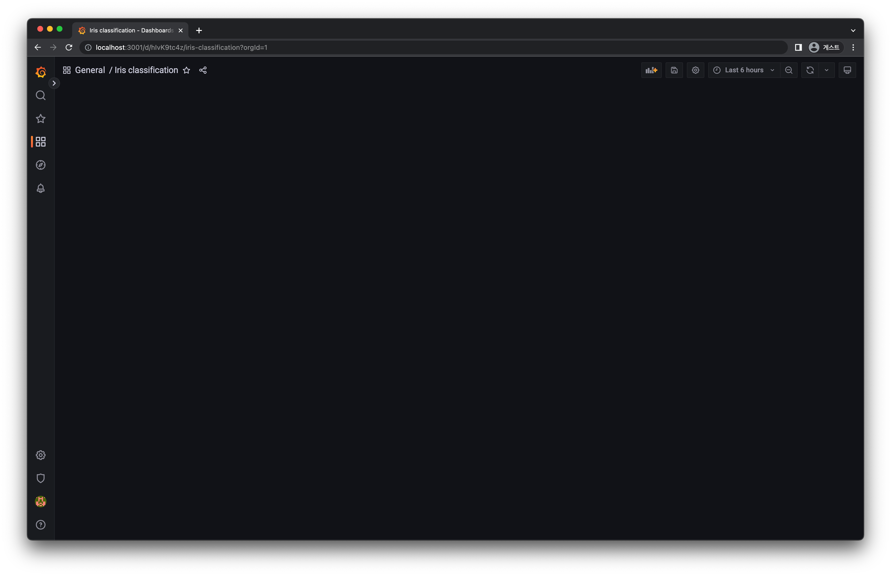
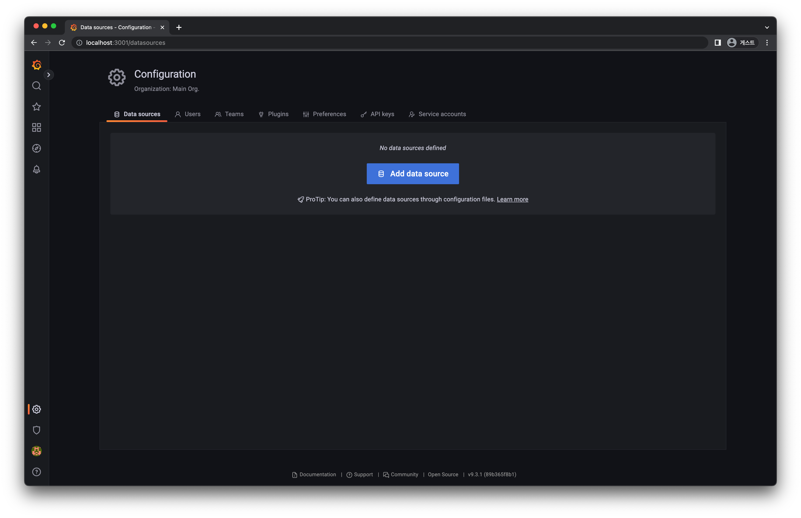
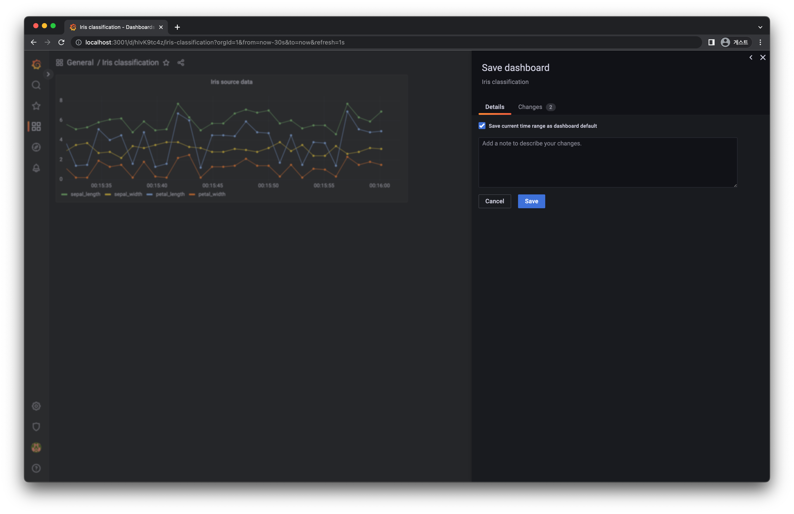
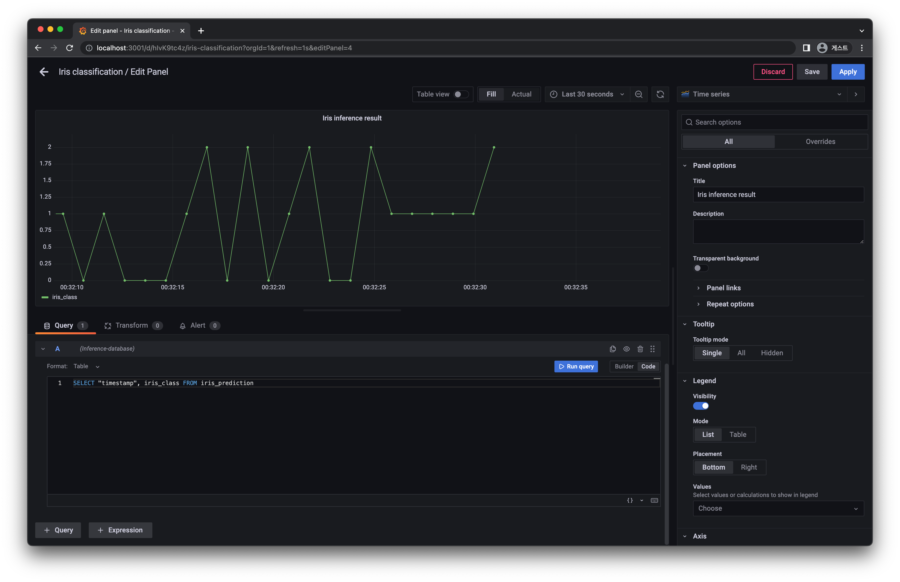

# 2) Dashboard
import CodeDescription from '@site/src/components/CodeDescription';
import PreviewDescription from '@site/src/components/PreviewDescription';
import BrowserWindow from '@site/src/components/BrowserWindow';
import { Chapter, Part } from '@site/src/components/Highlight';

<PreviewDescription>

## Chapter Preview
---
### 목표

1. Grafana 대시보드를 통해 실시간으로 데이터를 모니터링하는 대시보드를 작성합니다.
2. Grafana 에 원본 데이터와 예측값을 시각화하는 방법을 이해합니다.

### 스펙 명세서

1. Docker Compose 를 이용하여 실시간 모니터링 대시보드인 Grafana 를 생성합니다.

    - <var>GF_SECURITY_ADMIN_USER</var> : <code>dashboarduser</code>
    - <var>GF_SECURITY_ADMIN_PASSWORD</var> : <code>dashboardpassword</code>
    - <var>Port forwarding</var> : <code>3000:3000</code>
2. <Part>01. Database</Part> 파트에서 띄웠던 DB 를 확인하고 Grafana 에서 시각화합니다.

    - <var>host</var> : <code>postgres-server</code>
    - <var>port</var> : <code>5432</code>
    - <var>user</var> : <code>myuser</code>
    - <var>password</var> : <code>mypassword</code>
    - <var>database</var> : <code>mydatabase</code>
3. <Part>07. Kafka</Part> 파트에서 띄웠던 Target DB 를 확인하고 Grafana 에서 시각화합니다.

    - <var>host</var> : <code>target-postgres-server</code>
    - <var>port</var> : <code>5432</code>
    - <var>user</var> : <code>targetuser</code>
    - <var>password</var> : <code>targetpassword</code>
    - <var>database</var> : <code>targetdatabase</code>

</PreviewDescription>

<BrowserWindow url="https://github.com/mlops-for-mle/mlops-for-mle/tree/main/ch8">

해당 파트의 전체 코드는 [mlops-for-mle/ch8/](https://github.com/mlops-for-mle/mlops-for-mle/tree/main/ch8) 에서 확인할 수 있습니다.

```js
ch8
├── Dockerfile
├── Makefile
├── README.md
├── data_subscriber.py
// highlight-next-line
├── grafana-docker-compose.yaml
└── stream-docker-compose.yaml
```

</BrowserWindow>

## 1. Grafana

Grafana 는 멀티플랫폼 오픈 소스 애널리틱스 및 인터랙티브 시각화 웹 애플리케이션입니다. 지원되는 데이터 소스에 연결할 때 웹의 차트, 그래프, 알람을 제공합니다.

Grafana 의 다양한 종류의 차트를 활용해 상황에 맞는 대시보드를 구현할 수 있습니다. 
또한 오픈소스이기 때문에 자체적인 Grafana 커뮤니티도 활성화되어 필요한 정보나 만들어진 대시보드를 활용할 수 있습니다. 
또한 여러가지 데이터 소스로부터 데이터를 받아 시각화 할 수 있습니다.

Grafana 대시보드는 [그림 8-3] 의 형태로 존재합니다.

<div style={{textAlign: 'center'}}>

    
  [그림 8-3] Grafana 대시보드 구성도
</div>

- <var>Dashboard</var> : 

    - 페이지 자체를 구성하고 전체 대시보드 제목, 새로고침 주기, 패널이 시각화 할 기간 등을 정할 수 있습니다.
- <var>Panel</var> : 

    - <var>Dashboard</var> 안에 포함되어있는 차트를 의미합니다. 
    - 차트 제목, 차트 종류, 데이터 소스와 쿼리 등을 설정 할 수 있습니다.

## 2. Grafana Setup

### 2.1 Docker Compose

Grafana 를 생성할 Docker Compose 파일을 작성합니다.

<CodeDescription>

```yaml title="grafana-docker-compose.yaml"
# grafana-docker-compose.yaml
version: "3"

services:
  grafana-dashboard:
    image: grafana/grafana
    ports:
     - 3000:3000
    environment:
      GF_SECURITY_ADMIN_USER: dashboarduser
      GF_SECURITY_ADMIN_PASSWORD: dashboardpassword
      GF_DASHBOARDS_MIN_REFRESH_INTERVAL: 500ms
```

- <var>service</var> :

    - 서비스의 이름은 <code>grafana-dashboard</code> 로 합니다.
- <var>image</var> : 

    - 사용할 이미지는 <code>grafana/grafana</code> 입니다.
- <var>ports</var> : 

    - Grafana 의 포트를 지정합니다. 
    - 따로 정하지 않는 경우 내부적으로 3000 포트를 이용하기 때문에 외부 포트와의 연결에도 동일하게 <code>3000:3000</code> 으로 설정합니다.
- <var>environment</var> :

    - <var>GF_SECURITY_ADMIN_USER</var> : 

        - Grafana 에 접속하기 위한 admin 유저의 접속 아이디입니다.
        - 설정하지 않는 경우 기본값은 <code>admin</code> 입니다.
        - 이번 챕터에서는 <code>dashboarduser</code> 로 설정하겠습니다.
    - <var>GF_SECURITY_ADMIN_PASSWORD</var> : 

        - Grafana 에 접속하기 위한 admin 유저의 접속 비밀번호입니다.
        - 설정하지 않는 경우 기본값은 <code>admin</code> 입니다.
        - 이번 챕터에서는 <code>dashboardpassword</code> 로 설정하겠습니다.
    - <var>GF_DASHBOARDS_MIN_REFRESH_INTERVAL</var> : 

        - Grafana 에서 대시보드를 만들 때 실시간으로 패널들을 그리기 위한 새로고침이 필요하며, 해당 옵션은 새로고침 주기의 최소값을 변경합니다.
        - 설정하지 않는 경우 기본값은 <code>5s</code> 입니다.
        - 이번 챕터에서는 <code>500ms</code> 로 설정하겠습니다.

</CodeDescription>

:::info

Grafana 는 [config 파일](https://grafana.com/docs/grafana/latest/setup-grafana/configure-grafana/)로 <code>grafana.ini</code> 를 사용합니다. 
해당 config 파일을 설정하거나 규칙에 맞춰 환경 변수를 설정하여 Grafana 를 이용할 수 있습니다. 
[환경변수를 활용할 경우 규칙](https://grafana.com/docs/grafana/latest/setup-grafana/configure-grafana/#override-configuration-with-environment-variables)은 `GF_<SectionName>_<KeyName>` 입니다. 

Grafana 는 메타 데이터를 관리하기 위한 DB 를 정의해서 사용할 수 있습니다. 
정의되지 않은 경우, 기본값으로 서버에 포함되어 있는 SQLite3 를 사용합니다. 

:::

모든 서비스를 띄우는 코드는 아래와 같습니다.

```yaml title="grafana-docker-compose.yaml"
# grafana-docker-compose.yaml
version: "3"

services:
  grafana-dashboard:
    image: grafana/grafana
    ports:
     - 3000:3000
    environment:
      GF_SECURITY_ADMIN_USER: dashboarduser
      GF_SECURITY_ADMIN_PASSWORD: dashboardpassword
      GF_DASHBOARDS_MIN_REFRESH_INTERVAL: 500ms

networks:
  default:
    name: mlops-network
    external: true

```

### 2.2 실행 및 확인

#### 2.2.1 실행

`docker compose` 명령어를 이용하여 Grafana 서비스를 생성합니다.

<CodeDescription>

```bash
# terminal-command
docker compose -p ch8-dashboard -f grafana-docker-compose.yaml up -d
```

- <var>-p</var> : 

  - Project name 은 <code>ch8-dashboard</code> 로 사용합니다.
- <var>-f</var> :

  - File name 은 위에서 작성한 파일 이름인 <code>grafana-docker-compose.yaml</code> 을 적어줍니다.

</CodeDescription>

#### 2.2.1 서비스 확인

`docker ps` 명령어를 이용하여 Grafana 서비스가 잘 띄워졌는지 확인합니다.

```bash
# terminal-command
docker ps
CONTAINER ID   IMAGE             COMMAND     CREATED         STATUS         PORTS                    NAMES
f56ea8f3f3bd   grafana/grafana   "/run.sh"   7 seconds ago   Up 6 seconds   0.0.0.0:3000->3000/tcp   ch8-dashboard-grafana-dashboard-1
```

## 3 Grafana Dashboard 만들기

### 3.1 Login

서비스가 띄워졌다면, [localhost:3000](http://localhost:3000) 을 통해 Grafana 에 접속하여 설정했던 아이디와 비밀번호로 접속합니다.

<div style={{textAlign: 'center'}}>

  
[그림 8-4] Grafana 접속 화면
</div>
<div style={{textAlign: 'center'}}>

  
[그림 8-5] Grafana 로그인 후 화면
</div>

### 3.2 New Dashbaord

로그인이 잘 되었다면 왼쪽 사이드바의 `네모 모양 > New dashboard` 버튼을 클릭합니다.
<div style={{textAlign: 'center'}}>

  
[그림 8-6] Grafana 새 대시보드 생성
</div>
<div style={{textAlign: 'center'}}>

  
[그림 8-7] Grafana 대시보드 초기 화면
</div>

### 3.3 New Dashboard Setting

먼저 Dashboard 에 대한 설정을 해보겠습니다.

1. 오른쪽 위의 톱니바퀴 ⚙️ 버튼을 클릭합니다.
    <div style={{textAlign: 'center'}}>

      
    [그림 8-8] Grafana 톱니바퀴 클릭
    </div>

2. 대시보드의 정보들을 설정합니다.
    - <var>General</var>

        - 대시보드의 이름은 <code>Iris classification</code> 으로 합니다.
    - <var>Time options</var>

        - <code>Auto refresh</code> 영역에 <code>1s,</code> 를 추가하여 [그림 8-9]와 같이 만들어 줍니다.
        - <code>Refresh live dashboards</code> 토글을 클릭해 실시간으로 패널의 시간 축이 업데이트 되도록 해줍니다.

    <div style={{textAlign: 'center'}}>

      
    [그림 8-9] Grafana 대시보드 설정
    </div>

3. 오른쪽 위의 `Save dashboard` 버튼을 클릭하고, `General` 폴더에 저장합니다.

    <div style={{textAlign: 'center'}}>

      
    [그림 8-10] Grafana 대시보드 저장
    </div>

    <div style={{textAlign: 'center'}}>

      
    [그림 8-11] Grafana 대시보드 저장 후
    </div>

## 4. Source database 그리기

### 4.1 Data Source 연결하기

1. 왼쪽 아래 톱니바퀴 `⚙️ 버튼 > Data sources` 를 클릭합니다.

    <div style={{textAlign: 'center'}}>

      
    [그림 8-12] Grafana 데이터 소스 연결 진입
    </div>

2. `Add data source` 버튼을 클릭하고, PostgreSQL 을 검색하여 클릭합니다.

    <div style={{textAlign: 'center'}}>

      
    [그림 8-13] Grafana 데이터 소스 연결 클릭
    </div>

    <div style={{textAlign: 'center'}}>

        
    [그림 8-14] Grafana 데이터 소스 검색 1
    </div>

    <div style={{textAlign: 'center'}}>

      
    [그림 8-15] Grafana 데이터 소스 검색 2
    </div>

3. <Part>01. Database</Part> 파트에서 생성했던 Source DB 의 정보를 입력합니다. <code>Default</code> 로 체크되어 있는 토글은 해제해 줍니다. 작성이 끝나면 <code>Save & test</code> 버튼을 누릅니다.
    
    - <var>Name</var> : <code>Source-database</code>
    - <var>Host</var> : <code>postgres-server:5432</code>
    - <var>Database</var> : <code>mydatabase</code>
    - <var>User</var> : <code>myuser</code>
    - <var>Password</var> : <code>mypassword</code>
    - <var>TLS/SSL Mode</var> : <code>disable</code>
    - <var>Version</var> : <code>14.0</code>

    <div style={{textAlign: 'center'}}>

      
    [그림 8-16] Grafana Source DB 연결 설정
    </div>

4. Source DB 연결에 성공하면 `Database Connection OK` 라는 문구가 나타납니다.

    <div style={{textAlign: 'center'}}>

      
    [그림 8-17] Grafana Source DB 연결 확인
    </div>

### 4.2 Panel 만들기

1. `네모 모양 > Browse` 를 클릭하여 다음 화면으로 이동합니다.

    <div style={{textAlign: 'center'}}>

      
    [그림 8-18] Grafana 대시보드로 이동 1
    </div>

2. 그러면 앞서 만들어 두었던 `Iris classification` 대시보드를 확인할 수 있습니다. 클릭하여 이동합니다.

    <div style={{textAlign: 'center'}}>

      
    [그림 8-19] Grafana 대시보드로 이동 2
    </div>

    <div style={{textAlign: 'center'}}>

      
    [그림 8-20] Grafana 대시보드로 이동 3
    </div>

3. 이제 우측 상단의 차트 📊 버튼을 클릭하여 패널을 생성 합니다. 생성된 패널에서 `Add a new panel` 옵션을 선택합니다.
    <div style={{textAlign: 'center'}}>

      
    [그림 8-21] Grafana 패널 생성
    </div>

    <div style={{textAlign: 'center'}}>

      
    [그림 8-22] Grafana 패널 생성 2
    </div>

4. 패널의 정보를 설정합니다.
    - 우측 탭 : 패널의 이름, 차트의 종류 등을 설정 합니다.
        - 기본 값으로 `Time series` 차트가 설정되어 있습니다.
        - 오른쪽 탭의 `Title` 에 패널의 이름을 붙여줍니다. 
        - 이번 챕터에서는 `Iris source data` 로 설정합니다.
    - 하단 탭 : DB 에서 시각화 할 테이블 및 column 정보를 설정합니다.
        - <var>Data source</var> : <code>Source-database</code>
        - <var>Table</var> : <code>iris_data</code>
        - <var>Column</var> : ➕ 버튼을 눌러 시각화 대상의 column 을 추가합니다.

            - `timestamp`
            - `sepal_length`
            - `sepal_width`
            - `petal_length`
            - `petal_width`
        - `Run query` 버튼 오른쪽의 `Code` 버튼을 클릭하고 `Limit` 부분을 지워줍니다.
        - `Run query` 버튼을 클릭합니다.

    <div style={{textAlign: 'center'}}>

      
    [그림 8-23] Grafana 패널 설정
    </div>

5. 작업이 마무리 되었으면 오른쪽 위의 `Save` 버튼을 통해 패널을 저장합니다.

    <div style={{textAlign: 'center'}}>

      
    [그림 8-24] Grafana 패널 저장
    </div>

6. 저장이 완료되면 왼쪽 위의 화살표 ⬅️ 버튼을 눌러 뒤로 이동합니다.
7. 이제 대시보드의 패널 새로고침 주기 및 패널 시각화 기간을 설정합니다.
    - 오른쪽 위의 `🕙 Last 6 hours` 를 클릭하여 패널에 시각화 할 기간을 명세합니다.
    - 1초 단위로 데이터가 생성 되기 때문에, 30초를 모니터링 하기 위해서 `From` 부분을 `now-30s` 로 바꿔주겠습니다. 바꾸고 난 다음 `Apply time range` 버튼을 클릭 합니다.
    - 오른쪽 위의 🔄 버튼을 누르고 설정했던 `1s` 를 클릭합니다.

    <div style={{textAlign: 'center'}}>

      
    [그림 8-25] Grafana 시각화 기간 설정
    </div>

    <div style={{textAlign: 'center'}}>

      
    [그림 8-26] Grafana 새로고침 주기 설정
    </div>

8. 실시간 모니터링을 확인하고 수정된 대시보드를 오른쪽 위의 💾 버튼을 클릭하여 저장합니다.
    - 저장시에 `save current time range as dashboard default` 를 체크 합니다.

    <div style={{textAlign: 'center'}}>

      
    [그림 8-27] Grafana 대시보드 저장
    </div>

## 5. Inference database 그리기

앞서 Source Database 그리기에서 했던 내용을 반복합니다.

### 5.1 Data Source 연결하기

1. 왼쪽 아래 톱니바퀴 `⚙️ 버튼 > Data sources` 를 클릭합니다.

2. `Add data source` 버튼을 클릭하고, PostgreSQL 을 검색하여 클릭합니다.

    <div style={{textAlign: 'center'}}>

      
    [그림 8-28] Grafana 추론 결과 데이터 소스 이동
    </div>

3. <Part>01. Database</Part> 파트에서 생성했던 Target DB 의 정보를 입력합니다. <code>Default</code> 로 체크되어 있는 토글은 해제해 줍니다. 작성이 끝나면 <code>Save & test</code> 버튼을 누릅니다.

    - <var>Name</var> : <code>Inference-database</code>
    - <var>Host</var> : <code>target-postgres-server:5432</code>
    - <var>Database</var> : <code>targetdatabase</code>
    - <var>User</var> : <code>targetuser</code>
    - <var>Password</var> : <code>targetpassword</code>
    - <var>TLS/SSL Mode</var> : <code>disable</code>
    - <var>Version</var> : <code>14.0</code>

    <div style={{textAlign: 'center'}}>

      
    [그림 8-29] Grafana Target DB 연결 설정
    </div>

4. 마찬가지로 Target DB 연결에 성공하면 `Database Connection OK` 라는 문구가 나타납니다.

    <div style={{textAlign: 'center'}}>

      
    [그림 8-30] Grafana Target DB 연결 확인
    </div>

### 5.2 Panel 만들기

1. `네모 모양 > Browse` 를 클릭하여 다음 화면으로 이동합니다.

2. `Iris classification` dashboard 클릭하여 이동합니다.

    <div style={{textAlign: 'center'}}>

      
    [그림 8-31] Grafana 대시 보드로 이동
    </div>

    <div style={{textAlign: 'center'}}>

      
    [그림 8-32] Grafana 대시 보드로 이동 2
    </div>

3. 완성해두었던 `Iris source data` 패널을 확인하고, 오른쪽 상단의 차트 📊 버튼을 클릭하여 패널을 생성 합니다. 생성된 패널에서 `Add a new panel` 옵션을 선택합니다.

    <div style={{textAlign: 'center'}}>

      
    [그림 8-33] Grafana 추론 패널 생성
    </div>

5. 패널의 정보를 설정합니다.
    - 우측 탭 : 패널의 이름, 차트의 종류 등을 설정 합니다.
        - 기본 값으로 `Time series` 차트가 설정되어 있습니다.
        - 오른쪽 탭의 `Title` 에 패널의 이름을 붙여줍니다. 
        - 이번 챕터에서는 `Iris inference result` 로 설정하겠습니다.
    - 하단 탭 : 데이터 베이스에서 시각화 할 테이블 및 열 정보를 설정합니다.
        - <var>Data source</var> : <code>Inference-database</code>
        - <var>Table</var> : <code>iris_prediction</code>
        - <var>Column</var> : ➕ 버튼을 눌러 시각화 대상의 column 을 추가합니다.

            - `timestamp`
            - `iris_class`
        - `Run query` 버튼 오른쪽의 `Code` 버튼을 클릭하고 `Limit` 부분을 지워줍니다.
        - `Run query` 버튼을 클릭합니다.
6. 작업이 마무리 되었으면 오른쪽 위의 `Save` 버튼을 통해 패널을 저장합니다.
7. 저장이 완료되면 왼쪽 위의 화살표 ⬅️ 버튼을 눌러 뒤로 이동합니다.

    <div style={{textAlign: 'center'}}>

      
    [그림 8-34] Grafana 추론 패널 설정
    </div>

    <div style={{textAlign: 'center'}}>

      
    [그림 8-35] Grafana 추론 패널 저장
    </div>


## 6. 완성된 대시보드 확인

앞서 설정해둔 대시보드의 시각화 기간과 새로고침 주기는 다시 설정하지 않아도 전체 패널에 적용됩니다. 최종 시각화 결과를 확인합니다.

<div style={{textAlign: 'center'}}>

  
[그림 8-36] Grafana 최종 완성 대시보드
</div>
