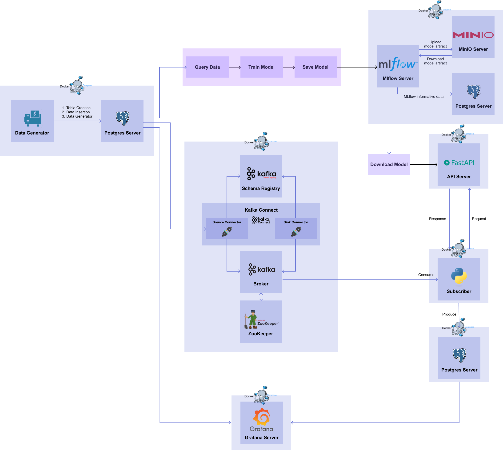

# 0) Overview

import { Chapter, Part } from '@site/src/components/Highlight';

:::caution

📌  해당 파트는 <Part>01. Database</Part> 파트의 Source DB 를 이용합니다.  
📌  해당 파트는 <Part>06. API Serving</Part> 파트의 API 서버를 이용합니다.  
📌  해당 파트는 <Part>07. Kafka</Part> 파트의 Kafka System 및 Target DB 를 이용합니다.  
📌  3가지 파트를 완료한 상태에서 해당 파트를 진행해 주세요.  

:::

이번 파트에서는 <Part>04. Model Deployment</Part> 에서 소개한 Event-Driven 방식을 구현해봅니다.  
<Part>07. Kafka</Part> 파트에서 띄워진 Kafka System 과 Target DB 에 더하여, Consumer 를 통해 토픽으로부터 데이터를 읽어와서 <Part>06. API Serving</Part> 파트의 REST API 의 입력으로 전달하고, inference 결과를 반환 받아 Target DB 로 전달하는 Data Subscriber 를 구현합니다. 
더 자세한 내용은 다음 챕터에서 알아보겠습니다.

또한, Stream Serving 뿐만 아니라 Grafana 를 이용하여 원본 데이터와 예측 결과 값을 실시간으로 시각화해주는 대시보드를 만듭니다.
대시보드를 통해 Stream Serving 이 잘 되고 있는지 확인합니다.

이번 파트를 통해 완성되는 workflow 는 다음과 같습니다.

[그림 8-1] Stream Serving Workflow

