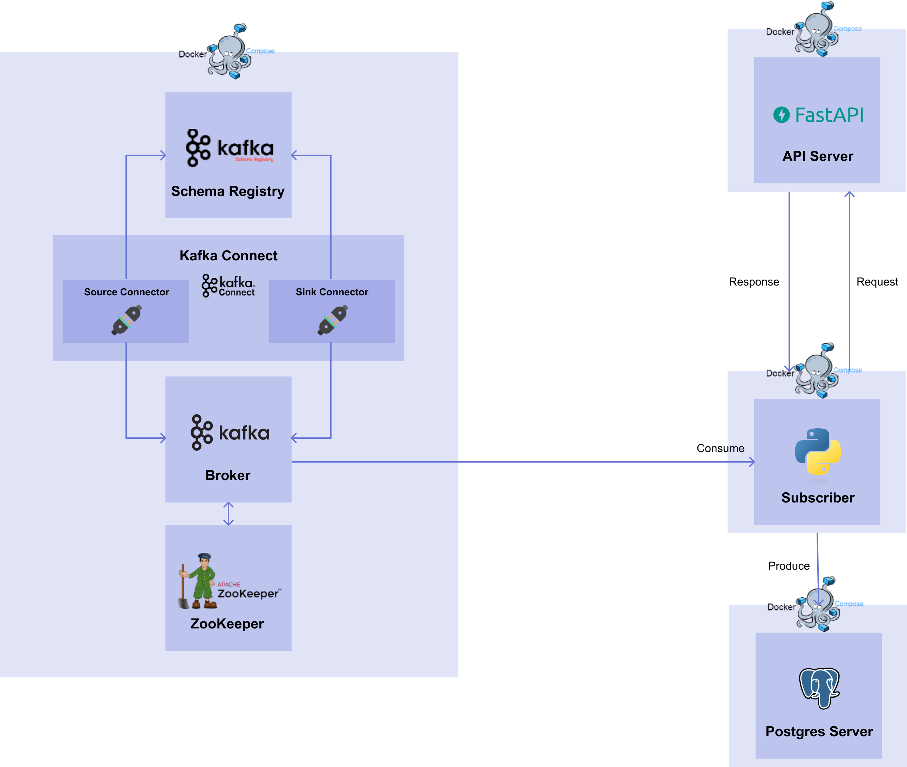

# 1) Stream Serving
import CodeDescription from '@site/src/components/CodeDescription';
import PreviewDescription from '@site/src/components/PreviewDescription';
import BrowserWindow from '@site/src/components/BrowserWindow';
import { Chapter, Part } from '@site/src/components/Highlight';

<PreviewDescription>

## Chapter Preview
---
### 목표

1. Stream Serving 을 위한 Data Subscriber 코드를 작성합니다.
2. Docker Compose 를 이용하여 Data Subcriber 를 생성합니다.
3. Target DB 에 접속하여 예측값이 잘 쌓이고 있는지 확인합니다.

### 스펙 명세서

1. Stream Serving 을 위한 Data Subscriber 코드를 작성합니다.

    - 1. `psycopg2` 패키지를 이용하여 예측값을 저장할 `iris_prediction` 테이블을 Target DB 서버에 생성합니다.
    - 2. `kafka-python` 패키지를 이용하여 <Part>07. Kafka</Part> 파트에서 생성한 토픽에서 데이터를 가져올 수 있는 Consumer 를 구현합니다.
            - <var>Topic name</var> : <code>postgres-source-iris_data</code>
            - <var>bootstrap_servers</var> : <code>broker:29092</code>
            - <var>auto_offset_reset</var> : <code>earliest</code>
            - <var>group_id</var> : <code>iris-data-consumer-group</code>
            - <var>value_deserializer</var> : <code>lambda x: loads(x)</code>
    - 3. `requests` 패키지를 이용하여 REST API 에 모델의 예측을 요청하고 예측값을 받습니다.
    - 4. 결과값을 `iris_prediction` 테이블에 삽입합니다.
2. Docker Compose 를 이용하여 Data Subscriber 를 생성합니다.
3. Target DB 에 접속하여 실제로 예측값이 잘 쌓이고 있는지 확인합니다.

</PreviewDescription>

<BrowserWindow url="https://github.com/mlops-for-mle/mlops-for-mle/tree/main/ch8">

해당 파트의 전체 코드는 [mlops-for-mle/ch8/](https://github.com/mlops-for-mle/mlops-for-mle/tree/main/ch8) 에서 확인할 수 있습니다.

```js
ch8
// highlight-next-line
├── Dockerfile
├── Makefile
├── README.md
// highlight-next-line
├── data_subscriber.py
├── grafana-docker-compose.yaml
// highlight-next-line
└── stream-docker-compose.yaml
```

</BrowserWindow>

## 0. 패키지 설치

이번 챕터에서 사용할 패키지들입니다.

```bash
# terminal-command
pip install kafka-python requests psycopg2-binary
```
- <var>kafka-python</var> : 

    - Python 에서 Kafka 를 SDK 형태로 사용하도록 도와주는 Kafka Python Client 패키지입니다.
    - 해당 챕터에서는 Consumer 를 구현할 때 사용합니다.
- <var>requests</var> : 

    - Python 으로 HTTP 통신이 필요한 프로그램을 작성할 때 가장 많이 사용되는 패키지입니다. 
    - REST API 를 호출할 때 사용합니다.

## 1. Architecture

이번 챕터에서 구현할 서비스들은 [그림 8-2]와 같습니다.

<div style={{textAlign: 'center'}}>


[그림 8-2] Stream Serving Workflow
</div>
<p>
<Part>07. Kafka</Part> 파트에서는 Source Connector 와 Sink Connector 를 생성하여 Source DB 에서 Target DB 로 데이터를 전달하는 과정을 살펴봤습니다.
<Part>08. Stream</Part> 파트에서는 다시 Model Deployment 관점으로 돌아와서 Kafka 를 어떻게 쓸 지 살펴보겠습니다.<br></br>
</p>
<p>
이번 파트에서는 <Part>07. Kafka</Part> 파트와 동일한 주키퍼, 브로커, Connect, Schema Registry 를 사용합니다.
또한 Source Connector 를 사용하여 데이터를 가져오는 과정도 동일합니다.
달라지는 점은 Sink Connector 를 대신해서 직접 Kafka Python SDK 를 이용하여 Consumer 를 구현하는 것입니다.
</p>
<p>
왜 직접 구현해서 사용해야 할까요?<br></br>
<Part>07. Kafka</Part> 파트에서 사용한 Sink Connector 를 살펴 보면, 설정 파일을 통해 생성한 후 자동으로 Sink Connector 가 해당 토픽에 있는 데이터를 읽어서 Target DB 에 전달했습니다.
하지만 <Part>08. Stream</Part> 파트에서는 <Part>06. API serving</Part> 파트에서 생성한 API 서버에 request 를 보내고 response 를 받아야합니다.
이 과정에서 Sink Connector 를 쓰려면 토픽에서 데이터를 읽어서 전달할 endpoint 가 필요하지만, API Serving 에서는 수동으로 request 를 보내고 response 를 받기 때문에 Sink Connector 를 사용할 수가 없습니다.
</p>
<p>
따라서 Source DB 에서 데이터를 받아 API 서버로 요청을 보내고, 모델의 예측 값을 받고, 받은 결과를 Target DB 에 삽입하는 과정을 담당하는 코드가 필요합니다.
</p>

따라서 이번 챕터에서는 Sink Connector 없이 `kafka-python`, `requests`, `psycopg2` 패키지들을 이용하여 Data Subscriber 를 구축해보겠습니다. 


## 2. Data Subscriber

이번에 구현할 Data Subscriber 의 절차는 다음과 같습니다.

1. `psycopg2` 패키지를 이용하여 Target DB 에 접근하여 테이블을 생성합니다.
2. `kafka-python` 패키지를 이용하여 브로커의 토픽에 있는 데이터를 읽는 Consumer 를 생성합니다.
3. `requests` 패키지를 이용하여 Consumer 를 통해 받은 데이터를 <Part>06. API serving</Part> 파트에서 띄운 API 서버에 데이터를 보내고 예측값을 받습니다.
4. `psycopg2` 패키지를 이용하여 받은 response 를 Target DB 에 삽입합니다.


### 2.1 Prediction 테이블 생성

먼저, 예측값을 저장할 테이블을 생성합니다.
전반적인 코드는 <Part>01. Database</Part> 파트와 동일하며 다른 내용은 아래와 같습니다.

<CodeDescription>

```python  title="data_subscriber.py"
import psycopg2

def create_table(db_connect):
    create_table_query = """
    CREATE TABLE IF NOT EXISTS iris_prediction (
        id SERIAL PRIMARY KEY,
        timestamp timestamp,
        iris_class int
    );"""
    print(create_table_query)
    with db_connect.cursor() as cur:
        cur.execute(create_table_query)
        db_connect.commit()

if __name__ == "__main__":
    db_connect = psycopg2.connect(
        user="targetuser",
        password="targetpassword",
        host="target-postgres-server",
        port=5432,
        database="targetdatabase",
    )
    create_table(db_connect)
```

- <var>Connection</var> :

    - <var>user</var> : <code>targetuser</code>
    - <var>password</var> : <code>targetpassword</code>
    - <var>host</var> : <code>target-postgres-server</code>
    - <var>port</var> : <code>5432</code>
    - <var>database</var> : <code>targetdatabase</code>
- <var>Table name</var> : <code>iris_prediction</code>
- <var>Schema</var> : 

    - <code>id (PK)</code>, <code>timestamp (timestamp)</code>, <code>iris_class (int)</code>

</CodeDescription>

### 2.2 Consumer 생성

다음으로, Consumer 를 생성하겠습니다.  
`kafka-python` 패키지를 이용하여 `KafkaConsumer` 의 인스턴스를 만들겠습니다.

<CodeDescription>

```python  title="data_subscriber.py"
from json import loads
from kafka import KafkaConsumer

consumer = KafkaConsumer(
    "postgres-source-iris_data",
    bootstrap_servers="broker:29092",
    auto_offset_reset="earliest",
    group_id="iris-data-consumer-group",
    value_deserializer=lambda x: loads(x),
)
```
- <var>topics</var>:

    - 데이터를 읽어들이고 싶은 토픽을 설정합니다.
- <var>bootstrap_servers</var> :

    - Bootstrap 서버로 띄워져있는 브로커의 <code>브로커 서비스 이름 : 브로커 서비스 내부 포트</code> 을 넣습니다.
- <var>auto_offset_reset</var> :

    - 토픽에 있는 데이터를 어떤 offset 값부터 가져올 지 설정합니다. 
    - 2가지 설정이 있으며, <code>earliest</code> 는 가장 초기 offset 값, <code>latest</code> 는 가장 마지막 offset 값입니다.
    - 이번 챕터에서는 첫번째 데이터부터 가져오고 싶기 때문에 <code>earliest</code> 를 작성합니다.
- <var>group_id</var> : 

    - Consumer 그룹을 식별하기 위해 그룹 ID 를 설정합니다.
- <var>value_deserializer</var> :

    - Source connector (또는 Produceer) 에서 serialization 된 value 값을 deserialization 할 때 사용할 deserializer 를 설정합니다.
    - <Part>07. Kafka</Part>파트에서는 Connect 를 띄울 때 value converter 로서 Json Converter 를 사용하였습니다. 따라서 데이터는 json 으로 serialization 이 되어있습니다.
    - 이번 챕터에서는 데이터를 읽어서 Json Deserializer 를 이용하여 deserialization 을 해야 하기 때문에 lambda function 과 json 의 <code>loads</code> 를 이용하여 <code>lambda x: loads(x)</code> 를 작성합니다.

</CodeDescription>

이렇게 만들어진 Consumer 인스턴스는 for 문을 이용하여 토픽에 있는 데이터를 실시간으로 계속해서 가져올 수 있습니다.

```python  title="data_subscriber.py"
for msg in consumer:
    print(
        f"Topic : {msg.topic}\n"
        f"Partition : {msg.partition}\n"
        f"Offset : {msg.offset}\n"
        f"Key : {msg.key}\n"
        f"Value : {msg.value}\n",
    )
# Topic : postgres-source-iris_data
# Partition : 0
# Offset : 133
# Key : None
# Value : {'schema': {'type': 'struct', 'fields': [{'type': 'int32', 'optional': False, 'field': 'id'}, {'type': 'string', 'optional': True, 'field': 'timestamp'}, {'type': 'double', 'optional': True, 'field': 'sepal_length'}, {'type': 'double', 'optional': True, 'field': 'sepal_width'}, {'type': 'double', 'optional': True, 'field': 'petal_length'}, {'type': 'double', 'optional': True, 'field': 'petal_width'}, {'type': 'int32', 'optional': True, 'field': 'target'}], 'optional': False, 'name': 'iris_data'}, 'payload': {'id': 134, 'timestamp': '2022-12-15 04:49:41.21', 'sepal_length': 6.1, 'sepal_width': 2.8, 'petal_length': 4.0, 'petal_width': 1.3, 'target': 1}}
# 
# Topic : postgres-source-iris_data
# Partition : 0
# Offset : 134
# Key : None
# Value : {'schema': {'type': 'struct', 'fields': [{'type': 'int32', 'optional': False, 'field': 'id'}, {'type': 'string', 'optional': True, 'field': 'timestamp'}, {'type': 'double', 'optional': True, 'field': 'sepal_length'}, {'type': 'double', 'optional': True, 'field': 'sepal_width'}, {'type': 'double', 'optional': True, 'field': 'petal_length'}, {'type': 'double', 'optional': True, 'field': 'petal_width'}, {'type': 'int32', 'optional': True, 'field': 'target'}], 'optional': False, 'name': 'iris_data'}, 'payload': {'id': 135, 'timestamp': '2022-12-15 04:49:42.27', 'sepal_length': 6.2, 'sepal_width': 2.9, 'petal_length': 4.3, 'petal_width': 1.3, 'target': 1}}
#
# Topic : postgres-source-iris_data
# Partition : 0
# Offset : 135
# Key : None
# Value : {'schema': {'type': 'struct', 'fields': [{'type': 'int32', 'optional': False, 'field': 'id'}, {'type': 'string', 'optional': True, 'field': 'timestamp'}, {'type': 'double', 'optional': True, 'field': 'sepal_length'}, {'type': 'double', 'optional': True, 'field': 'sepal_width'}, {'type': 'double', 'optional': True, 'field': 'petal_length'}, {'type': 'double', 'optional': True, 'field': 'petal_width'}, {'type': 'int32', 'optional': True, 'field': 'target'}], 'optional': False, 'name': 'iris_data'}, 'payload': {'id': 225, 'timestamp': '2022-12-15 04:51:14.238', 'sepal_length': 6.7, 'sepal_width': 3.1, 'petal_length': 4.4, 'petal_width': 1.4, 'target': 1}}
```

Print 문과 출력된 형태를 통해 메시지에 있는 topic, partition, offset, key, value 을 볼 수 있습니다. 앞으로 사용할 데이터는 value 에 있는 payload 값입니다.

payload 값의 형태를 보면 아래와 같이 나오는 것을 볼 수 있습니다.

```json
'payload': {'id': 134, 'timestamp': '2022-12-15 04:49:41.21', 'sepal_length': 6.1, 'sepal_width': 2.8, 'petal_length': 4.0, 'petal_width': 1.3, 'target': 1}
``` 


### 2.3 API 호출

다음 과정은 읽어드린 데이터를 <Part>06. API Serving</Part> 파트에서 생성한 API 서버에 전달하고, 예측값을 받는 것입니다.

#### 2.3.1 Schema 확인

먼저 <Part>06. API Serving</Part> 파트에서 띄워둔 API 서버의 schema 를 살펴보겠습니다. 

```python title="schemas.py"
from pydantic import BaseModel

class PredictIn(BaseModel):
    sepal_length: float
    sepal_width: float
    petal_length: float
    petal_width: float

class PredictOut(BaseModel):
    iris_class: int
```

API 서버에 request 로 보낼 값들에는 `sepal_length`, `sepal_width`, `petal_length`, `petal_width` column 이 있고, response 로 받는 값들에는 `iris_class` column 이 있습니다.

#### 2.3.2 API 요청 및 응답

API 서버에 request 로 보낼 값들 중 payload 에서 필요없는 column 들을 아래와 같이 삭제합니다.

```python  title="data_subscriber.py"
msg.value["payload"].pop("id")
msg.value["payload"].pop("target")
ts = msg.value["payload"].pop("timestamp")
```

timestamp 의 경우, Source DB 에서 나온 timestamp 를 Target DB 에 넣어줄 것이기 때문에 똑같이 삭제는 하되, `ts` 변수로 할당해줍니다.

이제 `requests` 패키지에 있는 POST method 를 이용하여 payload 값들을 보내고 response 를 받습니다. 

<CodeDescription>

```python  title="data_subscriber.py"
response = requests.post(
    url="http://api-with-model:8000/predict",
    json=msg.value["payload"],
    headers={"Content-Type": "application/json"},
).json()
response["timestamp"] = ts
```

- <var>url</var> : 

    - API 서버의 endpoint 를 설정합니다.
    - 이번 챕터에서는 API 서버의 호스트 이름과 포트, 그리고 POST method 인 predict 를 합하여 <code>http://api-with-model:8000/predict</code> 로 넣어줍니다.
- <var>json</var> : 

    - request 로 보낼 인자값들을 명시합니다.
    - 이번 챕터에서는 payload 값인 `msg.value["payload"]` 를 넣어줍니다.
- <var>headers</var> : 

    - Client 에서 Server 로 request 를 보낼 때 부가적인 정보를 전송할 수 있도록 설정합니다.
    - 이번 챕터에서는 보낼 때 json 형식으로 보낼 것이기 때문에 <code>{"Content-Type": "application/json"}</code> header 로 적어줍니다.
- Response 를 받고 난 뒤에 아까 남겨두었던 `ts` 변수를 response 에 넣어줍니다.

</CodeDescription>


### 2.4 Prediction 테이블에 예측값 삽입

마지막으로 <Part>01. Database</Part> 파트에서 사용했던 `insert_data` 함수를 이용하여 response 에 담긴 데이터를 Target DB 에 삽입합니다.

```python  title="data_subscriber.py"
def insert_data(db_connect, data):
    insert_row_query = f"""
    INSERT INTO iris_prediction
        (timestamp, iris_class)
        VALUES (
            '{data["timestamp"]}',
            {data["iris_class"]}
        );"""
    print(insert_row_query)
    with db_connect.cursor() as cur:
        cur.execute(insert_row_query)
        db_connect.commit()

insert_data(db_connect, response)
```

### 2.5 `data_subscriber.py`

앞서 살펴봤던 모든 코드들은 다음과 같습니다.

```python title="data_subscriber.py"
# data_subscriber.py
from json import loads

import psycopg2
import requests
from kafka import KafkaConsumer


def create_table(db_connect):
    create_table_query = """
    CREATE TABLE IF NOT EXISTS iris_prediction (
        id SERIAL PRIMARY KEY,
        timestamp timestamp,
        iris_class int
    );"""
    print(create_table_query)
    with db_connect.cursor() as cur:
        cur.execute(create_table_query)
        db_connect.commit()


def insert_data(db_connect, data):
    insert_row_query = f"""
    INSERT INTO iris_prediction
        (timestamp, iris_class)
        VALUES (
            '{data["timestamp"]}',
            {data["iris_class"]}
        );"""
    print(insert_row_query)
    with db_connect.cursor() as cur:
        cur.execute(insert_row_query)
        db_connect.commit()


def subscribe_data(db_connect, consumer):
    for msg in consumer:
        print(
            f"Topic : {msg.topic}\n"
            f"Partition : {msg.partition}\n"
            f"Offset : {msg.offset}\n"
            f"Key : {msg.key}\n"
            f"Value : {msg.value}\n",
        )

        msg.value["payload"].pop("id")
        msg.value["payload"].pop("target")
        ts = msg.value["payload"].pop("timestamp")

        response = requests.post(
            url="http://api-with-model:8000/predict",
            json=msg.value["payload"],
            headers={"Content-Type": "application/json"},
        ).json()
        response["timestamp"] = ts
        insert_data(db_connect, response)


if __name__ == "__main__":
    db_connect = psycopg2.connect(
        user="targetuser",
        password="targetpassword",
        host="target-postgres-server",
        port=5432,
        database="targetdatabase",
    )
    create_table(db_connect)

    consumer = KafkaConsumer(
        "postgres-source-iris_data",
        bootstrap_servers="broker:29092",
        auto_offset_reset="earliest",
        group_id="iris-data-consumer-group",
        value_deserializer=lambda x: loads(x),
    )
    subscribe_data(db_connect, consumer)
```

## 3. Docker Compose

### 3.1 Dockerfile

Data Subscriber 코드를 Docker 에서 실행할 Dockerfile 을 만듭니다.

```docker  title="Dockerfile"
FROM amd64/python:3.9-slim

WORKDIR /usr/app

RUN pip install -U pip &&\
    pip install psycopg2-binary kafka-python requests

COPY data_subscriber.py data_subscriber.py

ENTRYPOINT ["python", "data_subscriber.py"]
```

### 3.2 Docker Compose

Dockerfile 을 이용하여 Docker Compose 파일을 구성하면 아래와 같습니다.

```yaml title="stream-docker-compose.yaml"
# stream-docker-compose.yaml
version: "3"

services:
  data-subscriber:
    build:
      context: .
      dockerfile: Dockerfile
    container_name: data-subscriber

networks:
  default:
    name: mlops-network
    external: true
```

- 서비스들을 연결할 Docker Network 는 <Part>01. Database</Part> 파트에서 생성한 `mlops-network` 네트워크를 사용합니다. 

### 3.3 실행

`docker compose` 명령어를 이용하여 Data Subscriber 서비스를 생성합니다.

<CodeDescription>

```bash
# terminal-command
docker compose -p ch8-stream -f stream-docker-compose.yaml up -d
```

- <var>-p</var> : 

  - Project name 은 <code>ch8-stream</code> 로 사용합니다.
- <var>-f</var> :

  - File name 은 위에서 작성한 파일 이름인 <code>stream-docker-compose.yaml</code> 을 적어줍니다.

</CodeDescription>

### 3.4 데이터 확인

1. `psql` 로 Target DB 에 접속합니다.

    ```bash
    $ PGPASSWORD=targetpassword psql -h localhost -p 5433 -U targetuser -d targetdatabase
    psql (14.6, server 14.0 (Debian 14.0-1.pgdg110+1))
    Type "help" for help.

    targetdatabase=#
    ```

2. Select 문을 작성하여 `iris_prediction` 테이블에 있는 데이터를 확인합니다.

    ```bash
    targetdatabase=# SELECT * FROM iris_prediction LIMIT 100;
     id  |        timestamp        | iris_class 
    -----+-------------------------+------------
       1 | 2022-12-21 23:31:12.705 |          1
       2 | 2022-12-21 23:31:13.804 |          2
       3 | 2022-12-21 23:31:14.815 |          2
       4 | 2022-12-21 23:31:15.828 |          2
       5 | 2022-12-21 23:31:16.835 |          1
       6 | 2022-12-21 23:31:17.848 |          1
       7 | 2022-12-21 23:31:18.854 |          1
       8 | 2022-12-21 23:31:19.863 |          0
       9 | 2022-12-21 23:31:20.875 |          2
    ```
